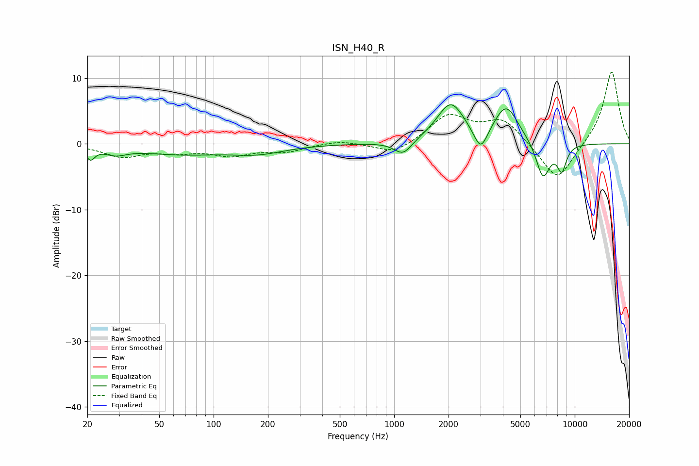

# ISN_H40_R
See [usage instructions](https://github.com/jaakkopasanen/AutoEq#usage) for more options and info.

### Parametric EQs
Apply preamp of -6.0 dB when using parametric equalizer.

|   # | Type    |   Fc (Hz) |    Q |   Gain (dB) |
|-----|---------|-----------|------|-------------|
|   1 | Peaking |        21 | 5.98 |        -1.8 |
|   2 | Peaking |        29 | 2.32 |        -1   |
|   3 | Peaking |        66 | 0.57 |        -1.5 |
|   4 | Peaking |       177 | 0.95 |        -1.2 |
|   5 | Peaking |      1121 | 2.86 |        -2.2 |
|   6 | Peaking |      2057 | 1.83 |         6   |
|   7 | Peaking |      3016 | 3.66 |        -3.7 |
|   8 | Peaking |      4175 | 2.04 |         5.6 |
|   9 | Peaking |      6668 | 3.49 |        -5.6 |
|  10 | Peaking |      8478 | 5.15 |        -3.8 |

### Fixed Band EQs
When using fixed band (also called graphic) equalizer, apply preamp of **-11.0 dB** (if available) and set gains manually with these parameters.

|   # | Type    |   Fc (Hz) |    Q |   Gain (dB) |
|-----|---------|-----------|------|-------------|
|   1 | Peaking |        31 | 1.41 |        -1.9 |
|   2 | Peaking |        62 | 1.41 |        -1   |
|   3 | Peaking |       125 | 1.41 |        -1.6 |
|   4 | Peaking |       250 | 1.41 |        -1.1 |
|   5 | Peaking |       500 | 1.41 |         0.6 |
|   6 | Peaking |      1000 | 1.41 |        -1.7 |
|   7 | Peaking |      2000 | 1.41 |         4.2 |
|   8 | Peaking |      4000 | 1.41 |         3.6 |
|   9 | Peaking |      8000 | 1.41 |        -6   |
|  10 | Peaking |     16000 | 1.41 |        11.2 |

### Graphs

