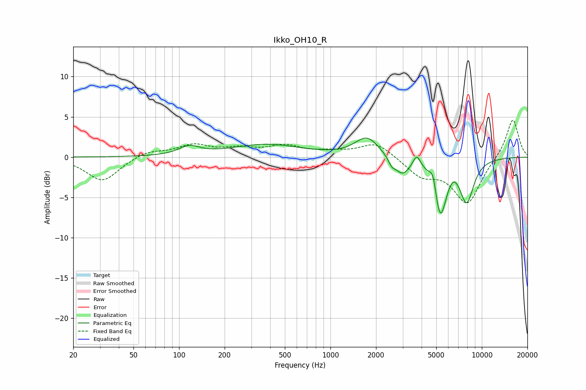

# Ikko_OH10_R
See [usage instructions](https://github.com/jaakkopasanen/AutoEq#usage) for more options and info.

### Parametric EQs
Apply preamp of -2.5 dB when using parametric equalizer.

|   # | Type    |   Fc (Hz) |    Q |   Gain (dB) |
|-----|---------|-----------|------|-------------|
|   1 | Peaking |       117 | 2.06 |         1.1 |
|   2 | Peaking |       379 | 0.6  |         1.5 |
|   3 | Peaking |      1744 | 1.78 |         2.4 |
|   4 | Peaking |      2547 | 5.91 |        -0.9 |
|   5 | Peaking |      2989 | 2.97 |        -2.1 |
|   6 | Peaking |      3717 | 6    |         1.5 |
|   7 | Peaking |      4771 | 6    |         2.3 |
|   8 | Peaking |      5299 | 3.28 |        -7.3 |
|   9 | Peaking |      6487 | 3.86 |         0.8 |
|  10 | Peaking |      7947 | 2.83 |        -5.2 |

### Fixed Band EQs
When using fixed band (also called graphic) equalizer, apply preamp of **-4.7 dB** (if available) and set gains manually with these parameters.

|   # | Type    |   Fc (Hz) |    Q |   Gain (dB) |
|-----|---------|-----------|------|-------------|
|   1 | Peaking |        31 | 1.41 |        -3   |
|   2 | Peaking |        62 | 1.41 |         0.8 |
|   3 | Peaking |       125 | 1.41 |         1.4 |
|   4 | Peaking |       250 | 1.41 |         0.9 |
|   5 | Peaking |       500 | 1.41 |         1.3 |
|   6 | Peaking |      1000 | 1.41 |         0.5 |
|   7 | Peaking |      2000 | 1.41 |         1.9 |
|   8 | Peaking |      4000 | 1.41 |        -2.1 |
|   9 | Peaking |      8000 | 1.41 |        -5.7 |
|  10 | Peaking |     16000 | 1.41 |         4.9 |

### Graphs

