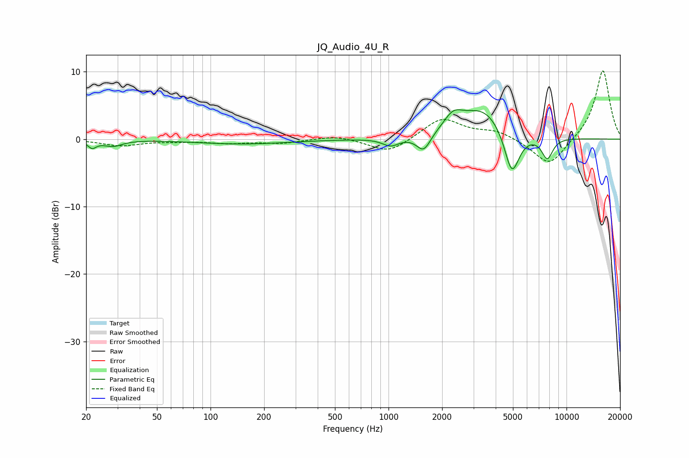

# JQ_Audio_4U_R
See [usage instructions](https://github.com/jaakkopasanen/AutoEq#usage) for more options and info.

### Parametric EQs
Apply preamp of -4.5 dB when using parametric equalizer.

|   # | Type    |   Fc (Hz) |    Q |   Gain (dB) |
|-----|---------|-----------|------|-------------|
|   1 | Peaking |        22 | 5.99 |        -1.1 |
|   2 | Peaking |        28 | 2.74 |        -0.9 |
|   3 | Peaking |       151 | 0.53 |        -0.7 |
|   4 | Peaking |      1029 | 3.04 |        -1.2 |
|   5 | Peaking |      1575 | 3.56 |        -2.6 |
|   6 | Peaking |      2306 | 2.72 |         2.1 |
|   7 | Peaking |      3415 | 1.06 |         4.7 |
|   8 | Peaking |      4930 | 3.19 |        -7   |
|   9 | Peaking |      7769 | 4.16 |        -2.6 |
|  10 | Peaking |      7892 | 4.65 |        -0.6 |

### Fixed Band EQs
When using fixed band (also called graphic) equalizer, apply preamp of **-10.2 dB** (if available) and set gains manually with these parameters.

|   # | Type    |   Fc (Hz) |    Q |   Gain (dB) |
|-----|---------|-----------|------|-------------|
|   1 | Peaking |        31 | 1.41 |        -0.9 |
|   2 | Peaking |        62 | 1.41 |        -0.2 |
|   3 | Peaking |       125 | 1.41 |        -0.5 |
|   4 | Peaking |       250 | 1.41 |        -0.6 |
|   5 | Peaking |       500 | 1.41 |         0.6 |
|   6 | Peaking |      1000 | 1.41 |        -2.1 |
|   7 | Peaking |      2000 | 1.41 |         3.2 |
|   8 | Peaking |      4000 | 1.41 |         1.2 |
|   9 | Peaking |      8000 | 1.41 |        -4.1 |
|  10 | Peaking |     16000 | 1.41 |        10.4 |

### Graphs

