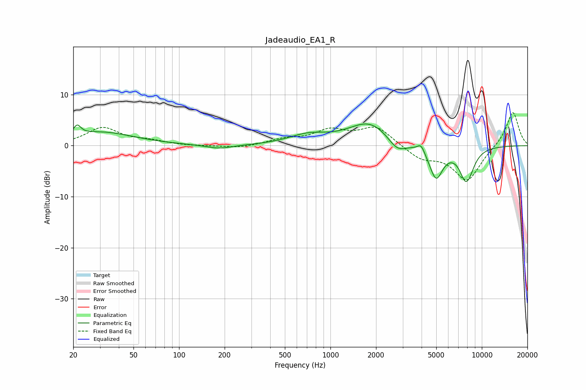

# Jadeaudio_EA1_R
See [usage instructions](https://github.com/jaakkopasanen/AutoEq#usage) for more options and info.

### Parametric EQs
Apply preamp of -4.3 dB when using parametric equalizer.

|   # | Type    |   Fc (Hz) |    Q |   Gain (dB) |
|-----|---------|-----------|------|-------------|
|   1 | Peaking |        21 | 5.83 |         1.9 |
|   2 | Peaking |        31 | 0.66 |         2.6 |
|   3 | Peaking |       184 | 1.61 |        -0.8 |
|   4 | Peaking |       709 | 1.12 |         1.8 |
|   5 | Peaking |      1820 | 1    |         4.6 |
|   6 | Peaking |      2761 | 2.25 |        -2.6 |
|   7 | Peaking |      3968 | 5.99 |         1.6 |
|   8 | Peaking |      4987 | 3.09 |        -6.3 |
|   9 | Peaking |      7952 | 3.25 |        -8.3 |
|  10 | Peaking |      8005 | 6    |         1.6 |

### Fixed Band EQs
When using fixed band (also called graphic) equalizer, apply preamp of **-6.6 dB** (if available) and set gains manually with these parameters.

|   # | Type    |   Fc (Hz) |    Q |   Gain (dB) |
|-----|---------|-----------|------|-------------|
|   1 | Peaking |        31 | 1.41 |         3.4 |
|   2 | Peaking |        62 | 1.41 |         0.8 |
|   3 | Peaking |       125 | 1.41 |        -0.1 |
|   4 | Peaking |       250 | 1.41 |        -0.5 |
|   5 | Peaking |       500 | 1.41 |         1.1 |
|   6 | Peaking |      1000 | 1.41 |         2.7 |
|   7 | Peaking |      2000 | 1.41 |         3.6 |
|   8 | Peaking |      4000 | 1.41 |        -2.4 |
|   9 | Peaking |      8000 | 1.41 |        -6.8 |
|  10 | Peaking |     16000 | 1.41 |         6.9 |

### Graphs

