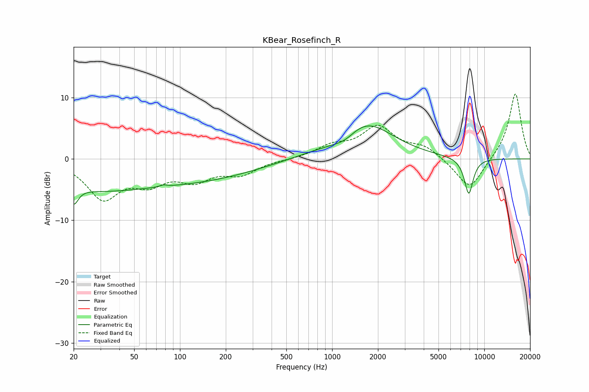

# KBear_Rosefinch_R
See [usage instructions](https://github.com/jaakkopasanen/AutoEq#usage) for more options and info.

### Parametric EQs
Apply preamp of -5.5 dB when using parametric equalizer.

|   # | Type    |   Fc (Hz) |    Q |   Gain (dB) |
|-----|---------|-----------|------|-------------|
|   1 | Peaking |        20 | 4.74 |        -2.9 |
|   2 | Peaking |        25 | 0.56 |        -1.5 |
|   3 | Peaking |        66 | 0.2  |        -4.1 |
|   4 | Peaking |        78 | 5.99 |         0.3 |
|   5 | Peaking |      1046 | 1.24 |        -0.5 |
|   6 | Peaking |      1092 | 0.46 |         0.7 |
|   7 | Peaking |      1225 | 1.89 |        -1.3 |
|   8 | Peaking |      1642 | 0.8  |         5.7 |
|   9 | Peaking |      7824 | 5.02 |         0.8 |
|  10 | Peaking |      7895 | 4.49 |        -6.7 |

### Fixed Band EQs
When using fixed band (also called graphic) equalizer, apply preamp of **-10.7 dB** (if available) and set gains manually with these parameters.

|   # | Type    |   Fc (Hz) |    Q |   Gain (dB) |
|-----|---------|-----------|------|-------------|
|   1 | Peaking |        31 | 1.41 |        -6.1 |
|   2 | Peaking |        62 | 1.41 |        -3.2 |
|   3 | Peaking |       125 | 1.41 |        -3   |
|   4 | Peaking |       250 | 1.41 |        -2.2 |
|   5 | Peaking |       500 | 1.41 |        -0.1 |
|   6 | Peaking |      1000 | 1.41 |         1.8 |
|   7 | Peaking |      2000 | 1.41 |         5   |
|   8 | Peaking |      4000 | 1.41 |         1.8 |
|   9 | Peaking |      8000 | 1.41 |        -5.2 |
|  10 | Peaking |     16000 | 1.41 |        10.9 |

### Graphs

