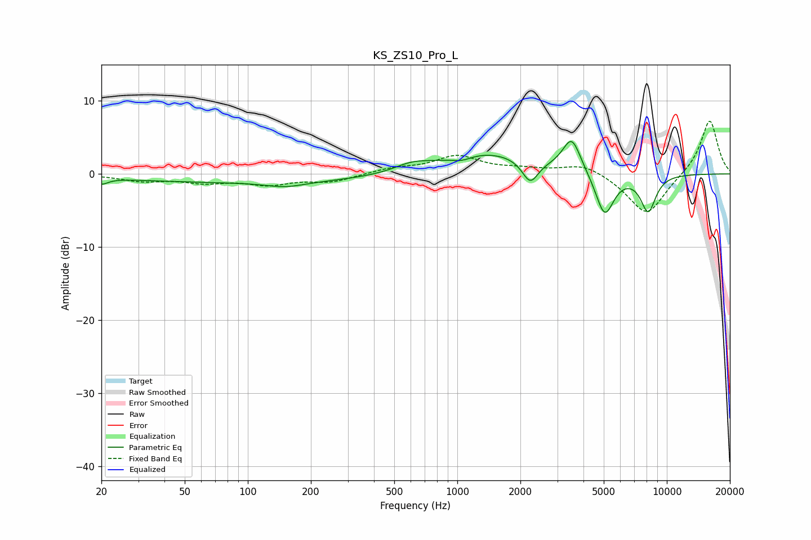

# KS_ZS10_Pro_L
See [usage instructions](https://github.com/jaakkopasanen/AutoEq#usage) for more options and info.

### Parametric EQs
Apply preamp of -4.5 dB when using parametric equalizer.

|   # | Type    |   Fc (Hz) |    Q |   Gain (dB) |
|-----|---------|-----------|------|-------------|
|   1 | Peaking |        20 | 4.6  |        -0.8 |
|   2 | Peaking |       113 | 0.19 |        -1.2 |
|   3 | Peaking |       151 | 1.51 |        -0.7 |
|   4 | Peaking |       604 | 1.77 |         0.9 |
|   5 | Peaking |      1048 | 2.81 |        -0.7 |
|   6 | Peaking |      1350 | 0.61 |         3.1 |
|   7 | Peaking |      2229 | 3.67 |        -3.2 |
|   8 | Peaking |      3517 | 3.26 |         4.6 |
|   9 | Peaking |      5051 | 3.15 |        -6   |
|  10 | Peaking |      8152 | 3.61 |        -5   |

### Fixed Band EQs
When using fixed band (also called graphic) equalizer, apply preamp of **-7.3 dB** (if available) and set gains manually with these parameters.

|   # | Type    |   Fc (Hz) |    Q |   Gain (dB) |
|-----|---------|-----------|------|-------------|
|   1 | Peaking |        31 | 1.41 |        -0.9 |
|   2 | Peaking |        62 | 1.41 |        -1   |
|   3 | Peaking |       125 | 1.41 |        -1.3 |
|   4 | Peaking |       250 | 1.41 |        -1   |
|   5 | Peaking |       500 | 1.41 |         0.7 |
|   6 | Peaking |      1000 | 1.41 |         2.3 |
|   7 | Peaking |      2000 | 1.41 |         0.5 |
|   8 | Peaking |      4000 | 1.41 |         1.5 |
|   9 | Peaking |      8000 | 1.41 |        -5.8 |
|  10 | Peaking |     16000 | 1.41 |         7.5 |

### Graphs

