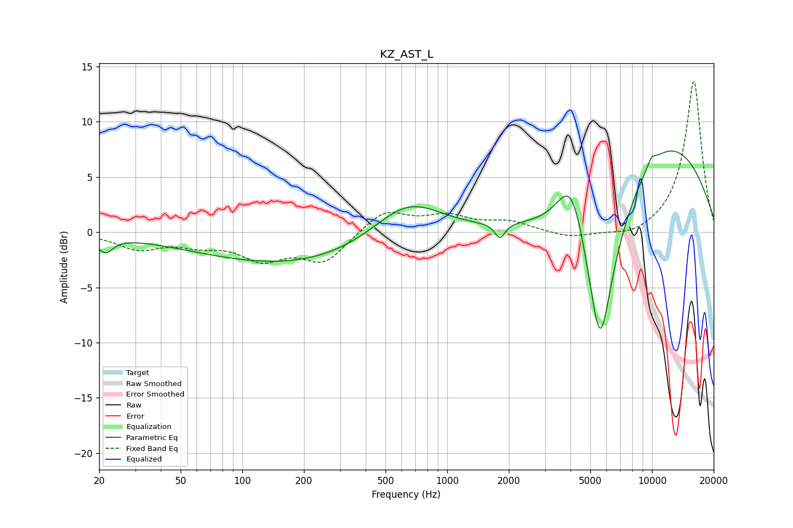

# KZ_AST_L
See [usage instructions](https://github.com/jaakkopasanen/AutoEq#usage) for more options and info.

### Parametric EQs
Apply preamp of -7.5 dB when using parametric equalizer.

|   # | Type    |   Fc (Hz) |    Q |   Gain (dB) |
|-----|---------|-----------|------|-------------|
|   1 | Peaking |        21 | 3.83 |        -1.4 |
|   2 | Peaking |       143 | 0.32 |        -2.3 |
|   3 | Peaking |       426 | 0.27 |        -1   |
|   4 | Peaking |       644 | 0.82 |         3.8 |
|   5 | Peaking |      1809 | 5.77 |        -1.4 |
|   6 | Peaking |      4057 | 1.86 |         6.7 |
|   7 | Peaking |      5517 | 0.82 |       -11.8 |
|   8 | Peaking |      5579 | 2.91 |        -8   |
|   9 | Peaking |      9503 | 0.33 |        10.8 |
|  10 | Peaking |      9957 | 6    |         0.7 |

### Fixed Band EQs
When using fixed band (also called graphic) equalizer, apply preamp of **-13.7 dB** (if available) and set gains manually with these parameters.

|   # | Type    |   Fc (Hz) |    Q |   Gain (dB) |
|-----|---------|-----------|------|-------------|
|   1 | Peaking |        31 | 1.41 |        -1.4 |
|   2 | Peaking |        62 | 1.41 |        -0.9 |
|   3 | Peaking |       125 | 1.41 |        -2.2 |
|   4 | Peaking |       250 | 1.41 |        -2.6 |
|   5 | Peaking |       500 | 1.41 |         2   |
|   6 | Peaking |      1000 | 1.41 |         1.3 |
|   7 | Peaking |      2000 | 1.41 |         0.9 |
|   8 | Peaking |      4000 | 1.41 |        -0.6 |
|   9 | Peaking |      8000 | 1.41 |        -0.6 |
|  10 | Peaking |     16000 | 1.41 |        13.8 |

### Graphs

