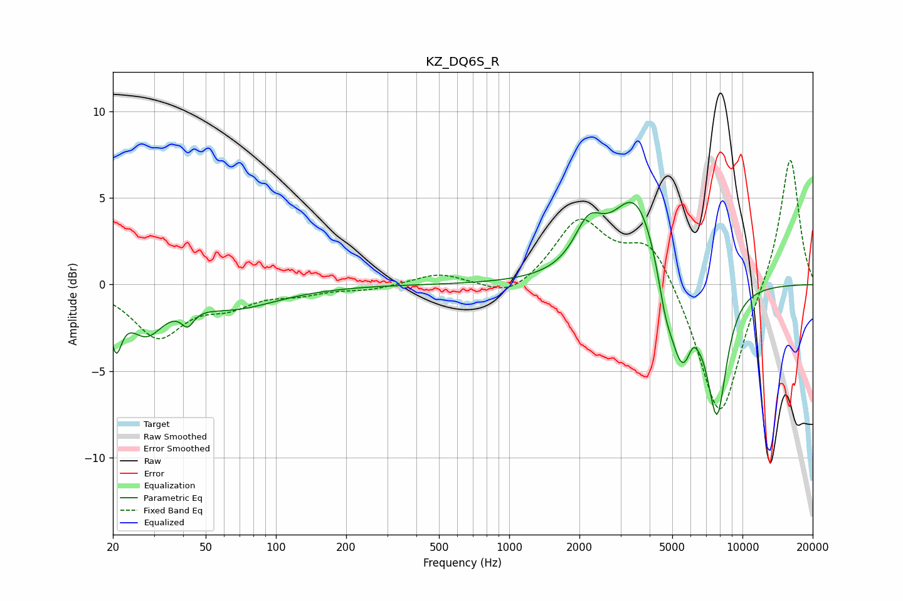

# KZ_DQ6S_R
See [usage instructions](https://github.com/jaakkopasanen/AutoEq#usage) for more options and info.

### Parametric EQs
Apply preamp of -4.8 dB when using parametric equalizer.

|   # | Type    |   Fc (Hz) |    Q |   Gain (dB) |
|-----|---------|-----------|------|-------------|
|   1 | Peaking |        21 | 5.77 |        -2.7 |
|   2 | Peaking |        28 | 1.91 |        -2.4 |
|   3 | Peaking |        42 | 5.5  |        -0.9 |
|   4 | Peaking |        66 | 0.74 |        -1.3 |
|   5 | Peaking |      2188 | 2.33 |         2.4 |
|   6 | Peaking |      3511 | 1.34 |         5.4 |
|   7 | Peaking |      4662 | 4.45 |        -1.7 |
|   8 | Peaking |      5492 | 2.41 |        -5.3 |
|   9 | Peaking |      6124 | 6    |         0.7 |
|  10 | Peaking |      7777 | 3.13 |        -7.1 |

### Fixed Band EQs
When using fixed band (also called graphic) equalizer, apply preamp of **-7.3 dB** (if available) and set gains manually with these parameters.

|   # | Type    |   Fc (Hz) |    Q |   Gain (dB) |
|-----|---------|-----------|------|-------------|
|   1 | Peaking |        31 | 1.41 |        -2.9 |
|   2 | Peaking |        62 | 1.41 |        -1   |
|   3 | Peaking |       125 | 1.41 |        -0.4 |
|   4 | Peaking |       250 | 1.41 |        -0.3 |
|   5 | Peaking |       500 | 1.41 |         0.7 |
|   6 | Peaking |      1000 | 1.41 |        -0.9 |
|   7 | Peaking |      2000 | 1.41 |         3.7 |
|   8 | Peaking |      4000 | 1.41 |         2.7 |
|   9 | Peaking |      8000 | 1.41 |        -8.1 |
|  10 | Peaking |     16000 | 1.41 |         7.6 |

### Graphs

