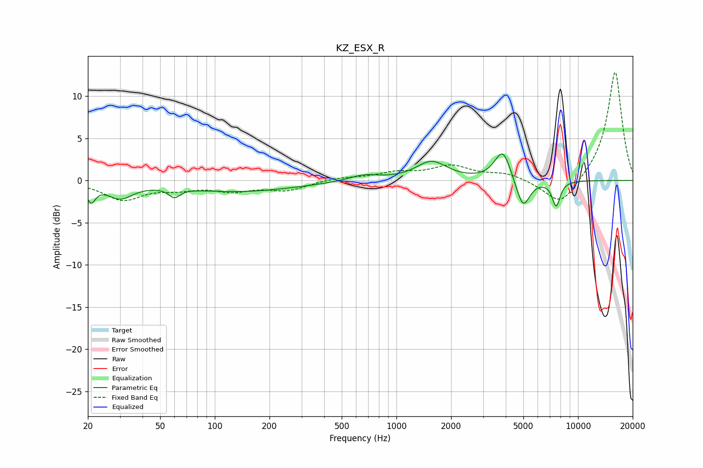

# KZ_ESX_R
See [usage instructions](https://github.com/jaakkopasanen/AutoEq#usage) for more options and info.

### Parametric EQs
Apply preamp of -3.2 dB when using parametric equalizer.

|   # | Type    |   Fc (Hz) |    Q |   Gain (dB) |
|-----|---------|-----------|------|-------------|
|   1 | Peaking |        21 | 5.97 |        -2   |
|   2 | Peaking |        30 | 2.02 |        -1.8 |
|   3 | Peaking |        60 | 4.67 |        -1.1 |
|   4 | Peaking |       136 | 0.44 |        -1.3 |
|   5 | Peaking |       661 | 1.67 |         0.7 |
|   6 | Peaking |      1560 | 1.66 |         2.2 |
|   7 | Peaking |      3719 | 2.85 |         1   |
|   8 | Peaking |      3886 | 3.44 |         2.7 |
|   9 | Peaking |      4979 | 3.71 |        -3.5 |
|  10 | Peaking |      7578 | 6    |        -3   |

### Fixed Band EQs
When using fixed band (also called graphic) equalizer, apply preamp of **-12.9 dB** (if available) and set gains manually with these parameters.

|   # | Type    |   Fc (Hz) |    Q |   Gain (dB) |
|-----|---------|-----------|------|-------------|
|   1 | Peaking |        31 | 1.41 |        -2.2 |
|   2 | Peaking |        62 | 1.41 |        -0.8 |
|   3 | Peaking |       125 | 1.41 |        -1.1 |
|   4 | Peaking |       250 | 1.41 |        -1.1 |
|   5 | Peaking |       500 | 1.41 |         0.3 |
|   6 | Peaking |      1000 | 1.41 |         0.8 |
|   7 | Peaking |      2000 | 1.41 |         1.6 |
|   8 | Peaking |      4000 | 1.41 |         0.8 |
|   9 | Peaking |      8000 | 1.41 |        -3.2 |
|  10 | Peaking |     16000 | 1.41 |        13.1 |

### Graphs

