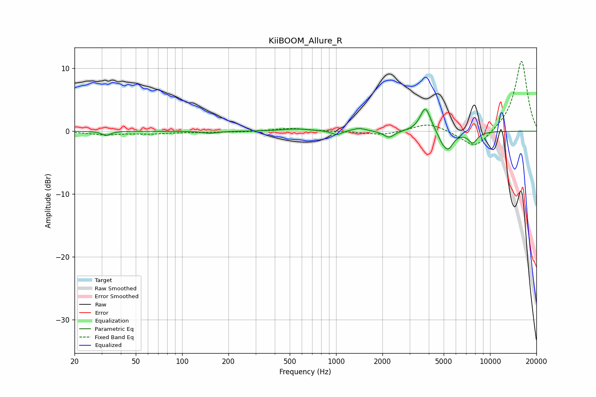

# KiiBOOM_Allure_R
See [usage instructions](https://github.com/jaakkopasanen/AutoEq#usage) for more options and info.

### Parametric EQs
Apply preamp of -3.6 dB when using parametric equalizer.

|   # | Type    |   Fc (Hz) |    Q |   Gain (dB) |
|-----|---------|-----------|------|-------------|
|   1 | Peaking |        32 | 5.35 |        -0.7 |
|   2 | Peaking |       152 | 2.98 |        -0.3 |
|   3 | Peaking |       552 | 1.58 |         0.4 |
|   4 | Peaking |      1008 | 4.56 |        -0.7 |
|   5 | Peaking |      1415 | 3.27 |         0.5 |
|   6 | Peaking |      2208 | 4.09 |        -1.1 |
|   7 | Peaking |      3801 | 4.16 |         3.9 |
|   8 | Peaking |      4830 | 6    |        -0.7 |
|   9 | Peaking |      5320 | 3.95 |        -2.8 |
|  10 | Peaking |      7724 | 4.4  |        -1.7 |

### Fixed Band EQs
When using fixed band (also called graphic) equalizer, apply preamp of **-11.2 dB** (if available) and set gains manually with these parameters.

|   # | Type    |   Fc (Hz) |    Q |   Gain (dB) |
|-----|---------|-----------|------|-------------|
|   1 | Peaking |        31 | 1.41 |        -0.5 |
|   2 | Peaking |        62 | 1.41 |        -0.4 |
|   3 | Peaking |       125 | 1.41 |        -0.1 |
|   4 | Peaking |       250 | 1.41 |        -0.1 |
|   5 | Peaking |       500 | 1.41 |         0.5 |
|   6 | Peaking |      1000 | 1.41 |        -0   |
|   7 | Peaking |      2000 | 1.41 |        -0.6 |
|   8 | Peaking |      4000 | 1.41 |         1.4 |
|   9 | Peaking |      8000 | 1.41 |        -3   |
|  10 | Peaking |     16000 | 1.41 |        11.3 |

### Graphs

