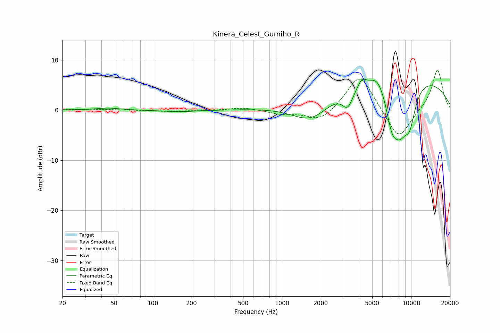

# Kinera_Celest_Gumiho_R
See [usage instructions](https://github.com/jaakkopasanen/AutoEq#usage) for more options and info.

### Parametric EQs
Apply preamp of -6.2 dB when using parametric equalizer.

|   # | Type    |   Fc (Hz) |    Q |   Gain (dB) |
|-----|---------|-----------|------|-------------|
|   1 | Peaking |        45 | 1.64 |         0.4 |
|   2 | Peaking |       162 | 0.99 |        -0.3 |
|   3 | Peaking |      1706 | 0.86 |        -5.6 |
|   4 | Peaking |      3232 | 3.31 |        -3.6 |
|   5 | Peaking |      4153 | 4.32 |         1.6 |
|   6 | Peaking |      5521 | 2.41 |         2.5 |
|   7 | Peaking |      7028 | 0.2  |         7.8 |
|   8 | Peaking |      7099 | 2.84 |        -5.9 |
|   9 | Peaking |      8203 | 1.85 |        -8.7 |
|  10 | Peaking |      9776 | 2.76 |        -5.9 |

### Fixed Band EQs
When using fixed band (also called graphic) equalizer, apply preamp of **-8.0 dB** (if available) and set gains manually with these parameters.

|   # | Type    |   Fc (Hz) |    Q |   Gain (dB) |
|-----|---------|-----------|------|-------------|
|   1 | Peaking |        31 | 1.41 |         0.2 |
|   2 | Peaking |        62 | 1.41 |         0   |
|   3 | Peaking |       125 | 1.41 |        -0.3 |
|   4 | Peaking |       250 | 1.41 |        -0.1 |
|   5 | Peaking |       500 | 1.41 |         0.5 |
|   6 | Peaking |      1000 | 1.41 |        -0.8 |
|   7 | Peaking |      2000 | 1.41 |        -2.4 |
|   8 | Peaking |      4000 | 1.41 |         7.5 |
|   9 | Peaking |      8000 | 1.41 |        -6.3 |
|  10 | Peaking |     16000 | 1.41 |         8.2 |

### Graphs

