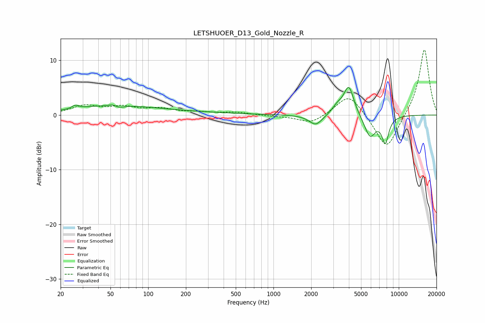

# LETSHUOER_D13_Gold_Nozzle_R
See [usage instructions](https://github.com/jaakkopasanen/AutoEq#usage) for more options and info.

### Parametric EQs
Apply preamp of -5.2 dB when using parametric equalizer.

|   # | Type    |   Fc (Hz) |    Q |   Gain (dB) |
|-----|---------|-----------|------|-------------|
|   1 | Peaking |        26 | 5.38 |         0.6 |
|   2 | Peaking |        52 | 0.46 |         1.7 |
|   3 | Peaking |        54 | 3.52 |         1.7 |
|   4 | Peaking |        55 | 3.12 |        -1.8 |
|   5 | Peaking |       207 | 0.4  |         0.4 |
|   6 | Peaking |      2176 | 2.66 |        -2   |
|   7 | Peaking |      3236 | 3.26 |         1.4 |
|   8 | Peaking |      3993 | 3.47 |         5.3 |
|   9 | Peaking |      5894 | 2.99 |        -4   |
|  10 | Peaking |      7807 | 4.78 |        -4.6 |

### Fixed Band EQs
When using fixed band (also called graphic) equalizer, apply preamp of **-12.0 dB** (if available) and set gains manually with these parameters.

|   # | Type    |   Fc (Hz) |    Q |   Gain (dB) |
|-----|---------|-----------|------|-------------|
|   1 | Peaking |        31 | 1.41 |         1.6 |
|   2 | Peaking |        62 | 1.41 |         1.3 |
|   3 | Peaking |       125 | 1.41 |         1   |
|   4 | Peaking |       250 | 1.41 |         0.4 |
|   5 | Peaking |       500 | 1.41 |         0.5 |
|   6 | Peaking |      1000 | 1.41 |        -0.2 |
|   7 | Peaking |      2000 | 1.41 |        -1.6 |
|   8 | Peaking |      4000 | 1.41 |         4.1 |
|   9 | Peaking |      8000 | 1.41 |        -6.7 |
|  10 | Peaking |     16000 | 1.41 |        12.3 |

### Graphs

