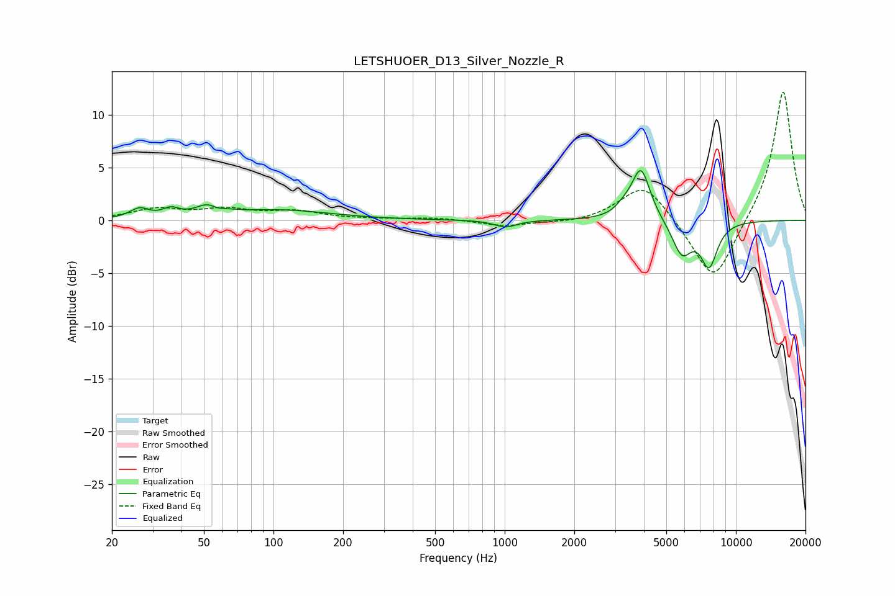

# LETSHUOER_D13_Silver_Nozzle_R
See [usage instructions](https://github.com/jaakkopasanen/AutoEq#usage) for more options and info.

### Parametric EQs
Apply preamp of -4.8 dB when using parametric equalizer.

|   # | Type    |   Fc (Hz) |    Q |   Gain (dB) |
|-----|---------|-----------|------|-------------|
|   1 | Peaking |        26 | 3.58 |         0.9 |
|   2 | Peaking |        36 | 4.16 |         0.7 |
|   3 | Peaking |        54 | 2.61 |         1.5 |
|   4 | Peaking |        57 | 4.07 |        -0.7 |
|   5 | Peaking |       108 | 0.66 |         0.9 |
|   6 | Peaking |      1010 | 2.92 |        -0.7 |
|   7 | Peaking |      3271 | 3.91 |         0.6 |
|   8 | Peaking |      3884 | 3.48 |         4.9 |
|   9 | Peaking |      5842 | 3.21 |        -3.2 |
|  10 | Peaking |      7654 | 3.68 |        -4.1 |

### Fixed Band EQs
When using fixed band (also called graphic) equalizer, apply preamp of **-12.3 dB** (if available) and set gains manually with these parameters.

|   # | Type    |   Fc (Hz) |    Q |   Gain (dB) |
|-----|---------|-----------|------|-------------|
|   1 | Peaking |        31 | 1.41 |         1   |
|   2 | Peaking |        62 | 1.41 |         0.9 |
|   3 | Peaking |       125 | 1.41 |         0.8 |
|   4 | Peaking |       250 | 1.41 |         0.1 |
|   5 | Peaking |       500 | 1.41 |         0.2 |
|   6 | Peaking |      1000 | 1.41 |        -0.6 |
|   7 | Peaking |      2000 | 1.41 |        -0.3 |
|   8 | Peaking |      4000 | 1.41 |         3.6 |
|   9 | Peaking |      8000 | 1.41 |        -6.2 |
|  10 | Peaking |     16000 | 1.41 |        12.5 |

### Graphs

