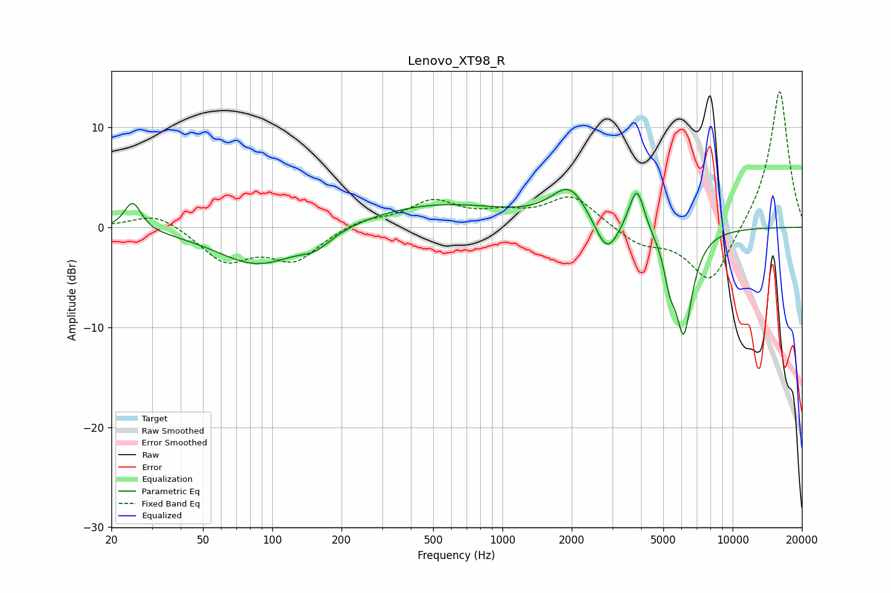

# Lenovo_XT98_R
See [usage instructions](https://github.com/jaakkopasanen/AutoEq#usage) for more options and info.

### Parametric EQs
Apply preamp of -3.9 dB when using parametric equalizer.

|   # | Type    |   Fc (Hz) |    Q |   Gain (dB) |
|-----|---------|-----------|------|-------------|
|   1 | Peaking |        25 | 3.89 |         2.9 |
|   2 | Peaking |        87 | 0.79 |        -3.8 |
|   3 | Peaking |       154 | 2.04 |        -1.2 |
|   4 | Peaking |       516 | 0.44 |         2.4 |
|   5 | Peaking |      1961 | 1.77 |         3.7 |
|   6 | Peaking |      2838 | 2.74 |        -3.5 |
|   7 | Peaking |      3642 | 3.73 |         0.8 |
|   8 | Peaking |      3853 | 4.59 |         3.9 |
|   9 | Peaking |      5325 | 5.87 |        -2.9 |
|  10 | Peaking |      6129 | 3.61 |       -10.3 |

### Fixed Band EQs
When using fixed band (also called graphic) equalizer, apply preamp of **-13.7 dB** (if available) and set gains manually with these parameters.

|   # | Type    |   Fc (Hz) |    Q |   Gain (dB) |
|-----|---------|-----------|------|-------------|
|   1 | Peaking |        31 | 1.41 |         1.6 |
|   2 | Peaking |        62 | 1.41 |        -3.3 |
|   3 | Peaking |       125 | 1.41 |        -3.1 |
|   4 | Peaking |       250 | 1.41 |         0.8 |
|   5 | Peaking |       500 | 1.41 |         2.5 |
|   6 | Peaking |      1000 | 1.41 |         1   |
|   7 | Peaking |      2000 | 1.41 |         3.1 |
|   8 | Peaking |      4000 | 1.41 |        -1.6 |
|   9 | Peaking |      8000 | 1.41 |        -5.9 |
|  10 | Peaking |     16000 | 1.41 |        14   |

### Graphs

