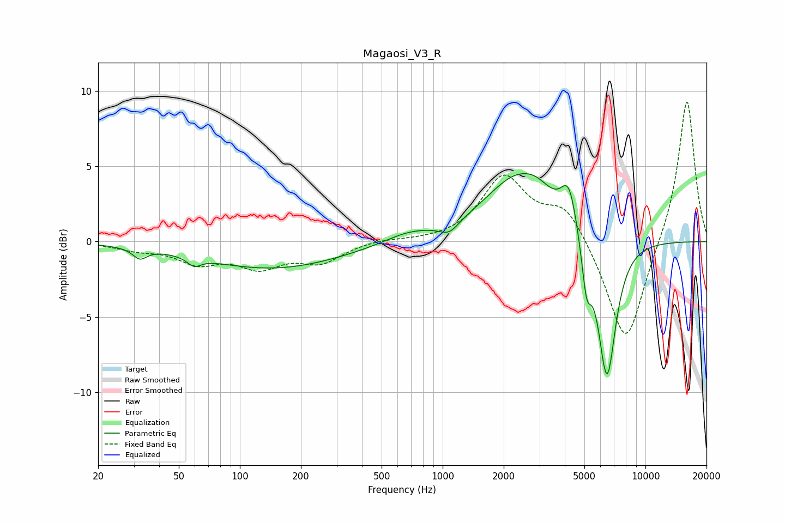

# Magaosi_V3_R
See [usage instructions](https://github.com/jaakkopasanen/AutoEq#usage) for more options and info.

### Parametric EQs
Apply preamp of -4.6 dB when using parametric equalizer.

|   # | Type    |   Fc (Hz) |    Q |   Gain (dB) |
|-----|---------|-----------|------|-------------|
|   1 | Peaking |        32 | 4.13 |        -0.7 |
|   2 | Peaking |        59 | 4.27 |        -0.6 |
|   3 | Peaking |       144 | 0.41 |        -1.8 |
|   4 | Peaking |       673 | 1.2  |         0.6 |
|   5 | Peaking |      1077 | 3.04 |        -0.7 |
|   6 | Peaking |      2394 | 0.84 |         4.4 |
|   7 | Peaking |      2936 | 2.28 |         0.5 |
|   8 | Peaking |      4196 | 3.58 |         2.8 |
|   9 | Peaking |      5124 | 5.94 |        -3.1 |
|  10 | Peaking |      6454 | 2.97 |        -9.6 |

### Fixed Band EQs
When using fixed band (also called graphic) equalizer, apply preamp of **-9.4 dB** (if available) and set gains manually with these parameters.

|   # | Type    |   Fc (Hz) |    Q |   Gain (dB) |
|-----|---------|-----------|------|-------------|
|   1 | Peaking |        31 | 1.41 |        -0.4 |
|   2 | Peaking |        62 | 1.41 |        -1.3 |
|   3 | Peaking |       125 | 1.41 |        -1.5 |
|   4 | Peaking |       250 | 1.41 |        -1.3 |
|   5 | Peaking |       500 | 1.41 |         0.2 |
|   6 | Peaking |      1000 | 1.41 |         0   |
|   7 | Peaking |      2000 | 1.41 |         4.2 |
|   8 | Peaking |      4000 | 1.41 |         2.3 |
|   9 | Peaking |      8000 | 1.41 |        -7.1 |
|  10 | Peaking |     16000 | 1.41 |         9.7 |

### Graphs

