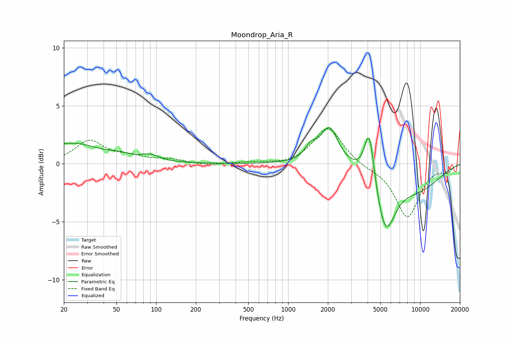

# Moondrop_Aria_R
See [usage instructions](https://github.com/jaakkopasanen/AutoEq#usage) for more options and info.

### Parametric EQs
Apply preamp of -3.2 dB when using parametric equalizer.

|   # | Type    |   Fc (Hz) |    Q |   Gain (dB) |
|-----|---------|-----------|------|-------------|
|   1 | Peaking |        20 | 6    |        -1.3 |
|   2 | Peaking |        20 | 5.91 |         1.4 |
|   3 | Peaking |        24 | 0.79 |         1.7 |
|   4 | Peaking |        52 | 1.61 |         0.4 |
|   5 | Peaking |        90 | 2.03 |         0.5 |
|   6 | Peaking |      1478 | 3.26 |         1   |
|   7 | Peaking |      2051 | 2.09 |         3.2 |
|   8 | Peaking |      4120 | 3.72 |         4.7 |
|   9 | Peaking |      5443 | 1.91 |        -5   |
|  10 | Peaking |      9307 | 0.6  |        -2   |

### Fixed Band EQs
When using fixed band (also called graphic) equalizer, apply preamp of **-3.1 dB** (if available) and set gains manually with these parameters.

|   # | Type    |   Fc (Hz) |    Q |   Gain (dB) |
|-----|---------|-----------|------|-------------|
|   1 | Peaking |        31 | 1.41 |         1.9 |
|   2 | Peaking |        62 | 1.41 |         0.5 |
|   3 | Peaking |       125 | 1.41 |         0.3 |
|   4 | Peaking |       250 | 1.41 |        -0.2 |
|   5 | Peaking |       500 | 1.41 |         0.1 |
|   6 | Peaking |      1000 | 1.41 |        -0.1 |
|   7 | Peaking |      2000 | 1.41 |         3.2 |
|   8 | Peaking |      4000 | 1.41 |        -0.3 |
|   9 | Peaking |      8000 | 1.41 |        -4.6 |
|  10 | Peaking |     16000 | 1.41 |        -0.6 |

### Graphs

