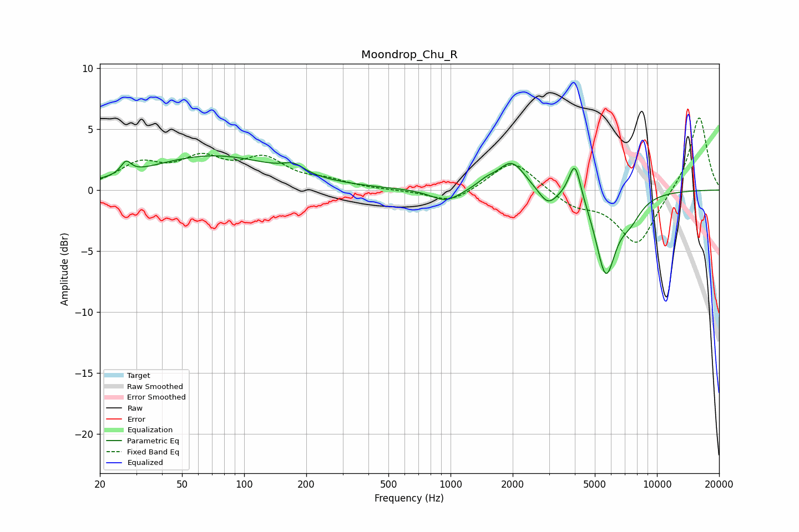

# Moondrop_Chu_R
See [usage instructions](https://github.com/jaakkopasanen/AutoEq#usage) for more options and info.

### Parametric EQs
Apply preamp of -2.9 dB when using parametric equalizer.

|   # | Type    |   Fc (Hz) |    Q |   Gain (dB) |
|-----|---------|-----------|------|-------------|
|   1 | Peaking |        27 | 6    |         1   |
|   2 | Peaking |        70 | 0.45 |         2.8 |
|   3 | Peaking |       174 | 2.77 |         0.7 |
|   4 | Peaking |       949 | 1.96 |        -1   |
|   5 | Peaking |      1485 | 3.15 |         0.5 |
|   6 | Peaking |      1977 | 2.16 |         2.4 |
|   7 | Peaking |      2962 | 3.26 |        -1.3 |
|   8 | Peaking |      4002 | 4.8  |         3.2 |
|   9 | Peaking |      5651 | 2.85 |        -6.6 |
|  10 | Peaking |      7397 | 2.38 |        -1.6 |

### Fixed Band EQs
When using fixed band (also called graphic) equalizer, apply preamp of **-6.0 dB** (if available) and set gains manually with these parameters.

|   # | Type    |   Fc (Hz) |    Q |   Gain (dB) |
|-----|---------|-----------|------|-------------|
|   1 | Peaking |        31 | 1.41 |         1.9 |
|   2 | Peaking |        62 | 1.41 |         2.2 |
|   3 | Peaking |       125 | 1.41 |         2.3 |
|   4 | Peaking |       250 | 1.41 |         0.6 |
|   5 | Peaking |       500 | 1.41 |        -0   |
|   6 | Peaking |      1000 | 1.41 |        -1.1 |
|   7 | Peaking |      2000 | 1.41 |         2.6 |
|   8 | Peaking |      4000 | 1.41 |        -1.2 |
|   9 | Peaking |      8000 | 1.41 |        -4.5 |
|  10 | Peaking |     16000 | 1.41 |         6.2 |

### Graphs

