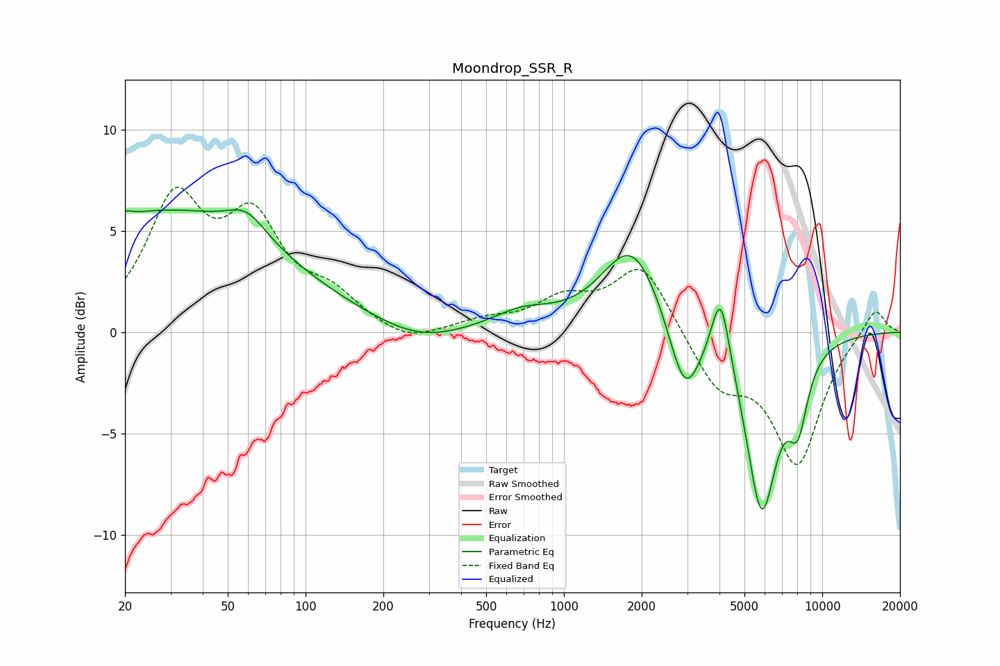

# Moondrop_SSR_R
See [usage instructions](https://github.com/jaakkopasanen/AutoEq#usage) for more options and info.

### Parametric EQs
Apply preamp of -6.1 dB when using parametric equalizer.

|   # | Type    |   Fc (Hz) |    Q |   Gain (dB) |
|-----|---------|-----------|------|-------------|
|   1 | Peaking |        20 | 5.81 |         0.3 |
|   2 | Peaking |        28 | 0.3  |         5.9 |
|   3 | Peaking |        59 | 1.86 |         1.2 |
|   4 | Peaking |       274 | 0.85 |        -0.8 |
|   5 | Peaking |       688 | 1.18 |         0.9 |
|   6 | Peaking |      1839 | 1.21 |         4.4 |
|   7 | Peaking |      2936 | 2.3  |        -3.8 |
|   8 | Peaking |      4039 | 3.97 |         3.7 |
|   9 | Peaking |      5824 | 2.24 |        -8.7 |
|  10 | Peaking |      8046 | 3.39 |        -3.2 |

### Fixed Band EQs
When using fixed band (also called graphic) equalizer, apply preamp of **-7.3 dB** (if available) and set gains manually with these parameters.

|   # | Type    |   Fc (Hz) |    Q |   Gain (dB) |
|-----|---------|-----------|------|-------------|
|   1 | Peaking |        31 | 1.41 |         6.2 |
|   2 | Peaking |        62 | 1.41 |         4.9 |
|   3 | Peaking |       125 | 1.41 |         1.5 |
|   4 | Peaking |       250 | 1.41 |        -0.7 |
|   5 | Peaking |       500 | 1.41 |         0.5 |
|   6 | Peaking |      1000 | 1.41 |         1.4 |
|   7 | Peaking |      2000 | 1.41 |         3.4 |
|   8 | Peaking |      4000 | 1.41 |        -2.6 |
|   9 | Peaking |      8000 | 1.41 |        -6.3 |
|  10 | Peaking |     16000 | 1.41 |         1.3 |

### Graphs

