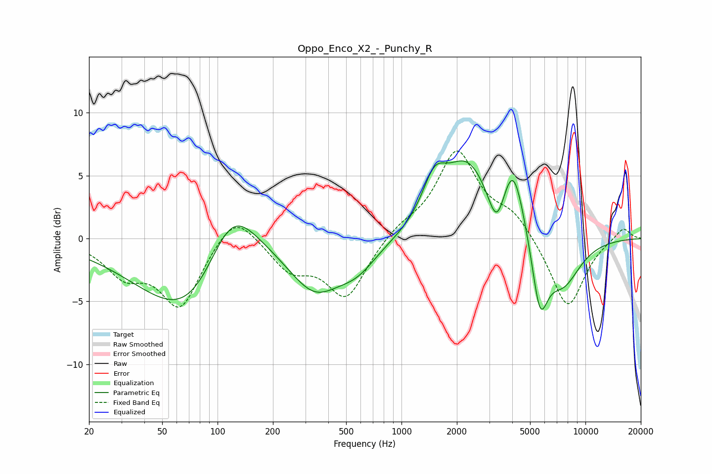

# Oppo_Enco_X2_-_Punchy_R
See [usage instructions](https://github.com/jaakkopasanen/AutoEq#usage) for more options and info.

### Parametric EQs
Apply preamp of -6.3 dB when using parametric equalizer.

|   # | Type    |   Fc (Hz) |    Q |   Gain (dB) |
|-----|---------|-----------|------|-------------|
|   1 | Peaking |        78 | 0.52 |        -9   |
|   2 | Peaking |       117 | 0.84 |         8.7 |
|   3 | Peaking |       338 | 1.01 |        -3.7 |
|   4 | Peaking |       574 | 1.29 |        -1.8 |
|   5 | Peaking |      1508 | 2.16 |         3.2 |
|   6 | Peaking |      2277 | 1.11 |         5.7 |
|   7 | Peaking |      3294 | 3.18 |        -3.1 |
|   8 | Peaking |      4052 | 2.31 |         5.3 |
|   9 | Peaking |      5660 | 3.13 |        -5.5 |
|  10 | Peaking |      7517 | 1.34 |        -3.7 |

### Fixed Band EQs
When using fixed band (also called graphic) equalizer, apply preamp of **-7.1 dB** (if available) and set gains manually with these parameters.

|   # | Type    |   Fc (Hz) |    Q |   Gain (dB) |
|-----|---------|-----------|------|-------------|
|   1 | Peaking |        31 | 1.41 |        -2.5 |
|   2 | Peaking |        62 | 1.41 |        -5.3 |
|   3 | Peaking |       125 | 1.41 |         2.5 |
|   4 | Peaking |       250 | 1.41 |        -2.3 |
|   5 | Peaking |       500 | 1.41 |        -4.6 |
|   6 | Peaking |      1000 | 1.41 |         0.9 |
|   7 | Peaking |      2000 | 1.41 |         6.8 |
|   8 | Peaking |      4000 | 1.41 |         1.8 |
|   9 | Peaking |      8000 | 1.41 |        -5.7 |
|  10 | Peaking |     16000 | 1.41 |         1   |

### Graphs

