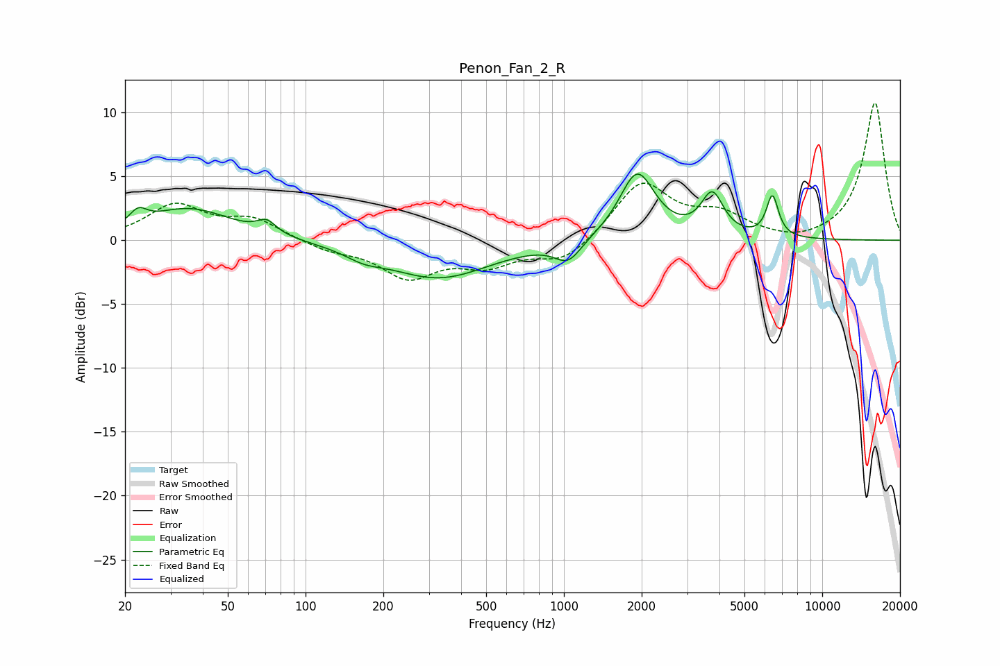

# Penon_Fan_2_R
See [usage instructions](https://github.com/jaakkopasanen/AutoEq#usage) for more options and info.

### Parametric EQs
Apply preamp of -5.3 dB when using parametric equalizer.

|   # | Type    |   Fc (Hz) |    Q |   Gain (dB) |
|-----|---------|-----------|------|-------------|
|   1 | Peaking |        23 | 5.32 |         2.7 |
|   2 | Peaking |        23 | 5.92 |        -1.7 |
|   3 | Peaking |        35 | 0.85 |         2.5 |
|   4 | Peaking |        71 | 3.95 |         1   |
|   5 | Peaking |       168 | 2.05 |        -0.6 |
|   6 | Peaking |       327 | 0.7  |        -2.9 |
|   7 | Peaking |      1038 | 2.76 |        -1.6 |
|   8 | Peaking |      1921 | 2.06 |         5.3 |
|   9 | Peaking |      3754 | 3.3  |         3.3 |
|  10 | Peaking |      6415 | 5.97 |         3.2 |

### Fixed Band EQs
When using fixed band (also called graphic) equalizer, apply preamp of **-10.8 dB** (if available) and set gains manually with these parameters.

|   # | Type    |   Fc (Hz) |    Q |   Gain (dB) |
|-----|---------|-----------|------|-------------|
|   1 | Peaking |        31 | 1.41 |         2.7 |
|   2 | Peaking |        62 | 1.41 |         1.5 |
|   3 | Peaking |       125 | 1.41 |        -0.7 |
|   4 | Peaking |       250 | 1.41 |        -2.7 |
|   5 | Peaking |       500 | 1.41 |        -1.7 |
|   6 | Peaking |      1000 | 1.41 |        -1.7 |
|   7 | Peaking |      2000 | 1.41 |         4.5 |
|   8 | Peaking |      4000 | 1.41 |         1.8 |
|   9 | Peaking |      8000 | 1.41 |        -0.4 |
|  10 | Peaking |     16000 | 1.41 |        10.8 |

### Graphs

