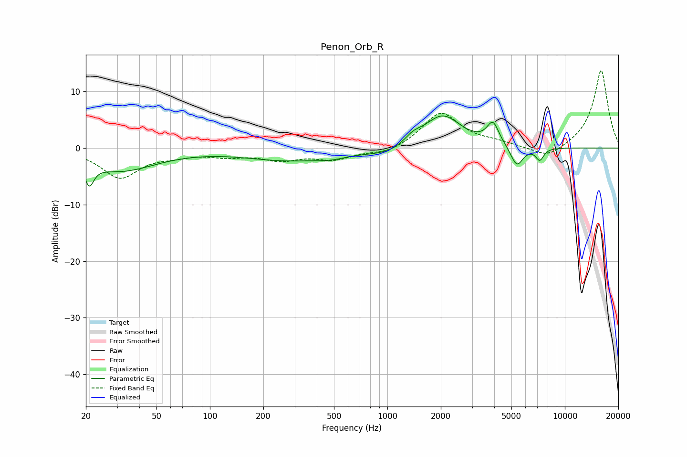

# Penon_Orb_R
See [usage instructions](https://github.com/jaakkopasanen/AutoEq#usage) for more options and info.

### Parametric EQs
Apply preamp of -5.8 dB when using parametric equalizer.

|   # | Type    |   Fc (Hz) |    Q |   Gain (dB) |
|-----|---------|-----------|------|-------------|
|   1 | Peaking |        21 | 5.72 |        -3.7 |
|   2 | Peaking |        31 | 0.7  |        -3.9 |
|   3 | Peaking |       273 | 0.58 |        -2   |
|   4 | Peaking |       480 | 1.72 |        -0.7 |
|   5 | Peaking |      1036 | 1.1  |        -1.4 |
|   6 | Peaking |      1389 | 2.86 |         1.4 |
|   7 | Peaking |      2040 | 1.32 |         5.9 |
|   8 | Peaking |      3933 | 4.15 |         3.8 |
|   9 | Peaking |      5361 | 3.96 |        -3.7 |
|  10 | Peaking |      7221 | 6    |        -2.1 |

### Fixed Band EQs
When using fixed band (also called graphic) equalizer, apply preamp of **-13.8 dB** (if available) and set gains manually with these parameters.

|   # | Type    |   Fc (Hz) |    Q |   Gain (dB) |
|-----|---------|-----------|------|-------------|
|   1 | Peaking |        31 | 1.41 |        -5.1 |
|   2 | Peaking |        62 | 1.41 |        -0.9 |
|   3 | Peaking |       125 | 1.41 |        -1.1 |
|   4 | Peaking |       250 | 1.41 |        -1.8 |
|   5 | Peaking |       500 | 1.41 |        -1.8 |
|   6 | Peaking |      1000 | 1.41 |        -1.1 |
|   7 | Peaking |      2000 | 1.41 |         6.3 |
|   8 | Peaking |      4000 | 1.41 |         0.7 |
|   9 | Peaking |      8000 | 1.41 |        -2.1 |
|  10 | Peaking |     16000 | 1.41 |        13.9 |

### Graphs

