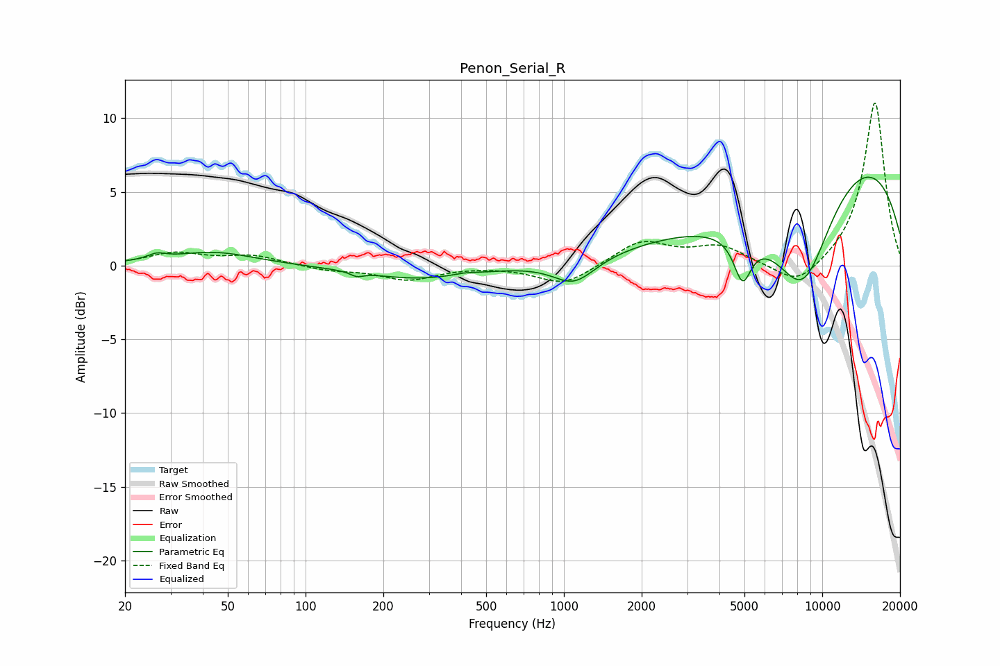

# Penon_Serial_R
See [usage instructions](https://github.com/jaakkopasanen/AutoEq#usage) for more options and info.

### Parametric EQs
Apply preamp of -6.1 dB when using parametric equalizer.

|   # | Type    |   Fc (Hz) |    Q |   Gain (dB) |
|-----|---------|-----------|------|-------------|
|   1 | Peaking |        27 | 4    |         0.4 |
|   2 | Peaking |        44 | 0.88 |         0.9 |
|   3 | Peaking |       158 | 5.76 |        -0.3 |
|   4 | Peaking |       273 | 0.68 |        -0.9 |
|   5 | Peaking |       413 | 3.21 |         0.1 |
|   6 | Peaking |      1097 | 1.73 |        -1.7 |
|   7 | Peaking |      4915 | 4.12 |        -3   |
|   8 | Peaking |      6370 | 0.45 |        -4   |
|   9 | Peaking |      8449 | 1.18 |        -6.4 |
|  10 | Peaking |     10000 | 0.24 |         9.4 |

### Fixed Band EQs
When using fixed band (also called graphic) equalizer, apply preamp of **-11.1 dB** (if available) and set gains manually with these parameters.

|   # | Type    |   Fc (Hz) |    Q |   Gain (dB) |
|-----|---------|-----------|------|-------------|
|   1 | Peaking |        31 | 1.41 |         0.8 |
|   2 | Peaking |        62 | 1.41 |         0.6 |
|   3 | Peaking |       125 | 1.41 |        -0.3 |
|   4 | Peaking |       250 | 1.41 |        -0.9 |
|   5 | Peaking |       500 | 1.41 |         0   |
|   6 | Peaking |      1000 | 1.41 |        -1.3 |
|   7 | Peaking |      2000 | 1.41 |         1.6 |
|   8 | Peaking |      4000 | 1.41 |         1.2 |
|   9 | Peaking |      8000 | 1.41 |        -1.6 |
|  10 | Peaking |     16000 | 1.41 |        11.2 |

### Graphs

