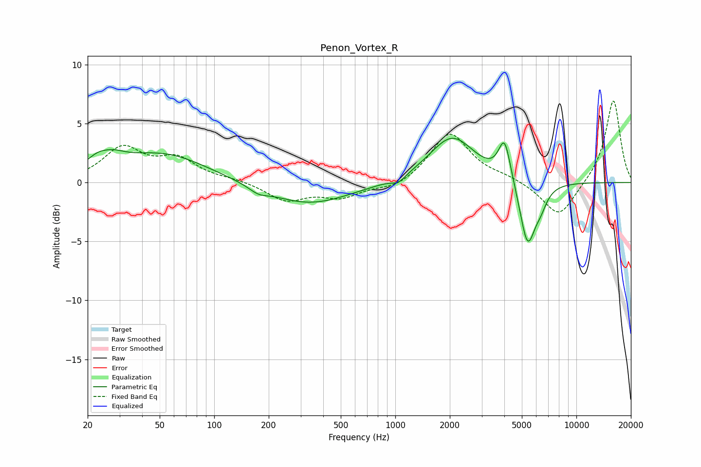

# Penon_Vortex_R
See [usage instructions](https://github.com/jaakkopasanen/AutoEq#usage) for more options and info.

### Parametric EQs
Apply preamp of -3.8 dB when using parametric equalizer.

|   # | Type    |   Fc (Hz) |    Q |   Gain (dB) |
|-----|---------|-----------|------|-------------|
|   1 | Peaking |        25 | 1.95 |         2.8 |
|   2 | Peaking |        25 | 2.67 |        -1.3 |
|   3 | Peaking |        53 | 0.59 |         2.4 |
|   4 | Peaking |       175 | 2.73 |        -0.5 |
|   5 | Peaking |       332 | 0.62 |        -1.9 |
|   6 | Peaking |      1043 | 3.79 |        -0.5 |
|   7 | Peaking |      2059 | 1.13 |         3.9 |
|   8 | Peaking |      4014 | 4.25 |         3.4 |
|   9 | Peaking |      5376 | 3.22 |        -5.5 |
|  10 | Peaking |      6351 | 3.91 |        -1.2 |

### Fixed Band EQs
When using fixed band (also called graphic) equalizer, apply preamp of **-7.0 dB** (if available) and set gains manually with these parameters.

|   # | Type    |   Fc (Hz) |    Q |   Gain (dB) |
|-----|---------|-----------|------|-------------|
|   1 | Peaking |        31 | 1.41 |         2.8 |
|   2 | Peaking |        62 | 1.41 |         1.8 |
|   3 | Peaking |       125 | 1.41 |         0.2 |
|   4 | Peaking |       250 | 1.41 |        -1.5 |
|   5 | Peaking |       500 | 1.41 |        -1.2 |
|   6 | Peaking |      1000 | 1.41 |        -0.6 |
|   7 | Peaking |      2000 | 1.41 |         4.2 |
|   8 | Peaking |      4000 | 1.41 |         0.4 |
|   9 | Peaking |      8000 | 1.41 |        -3   |
|  10 | Peaking |     16000 | 1.41 |         7.1 |

### Graphs

