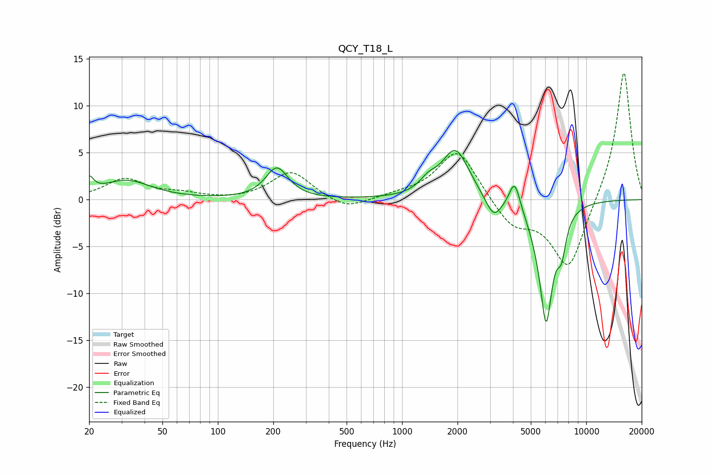

# QCY_T18_L
See [usage instructions](https://github.com/jaakkopasanen/AutoEq#usage) for more options and info.

### Parametric EQs
Apply preamp of -5.3 dB when using parametric equalizer.

|   # | Type    |   Fc (Hz) |    Q |   Gain (dB) |
|-----|---------|-----------|------|-------------|
|   1 | Peaking |        20 | 5.97 |         1.5 |
|   2 | Peaking |        32 | 1.07 |         2   |
|   3 | Peaking |       209 | 2.34 |         3.3 |
|   4 | Peaking |      1389 | 3.01 |         1.1 |
|   5 | Peaking |      1949 | 1.91 |         5.3 |
|   6 | Peaking |      3142 | 3.2  |        -2.3 |
|   7 | Peaking |      4086 | 4.77 |         3.1 |
|   8 | Peaking |      5256 | 2.57 |        -0.8 |
|   9 | Peaking |      6055 | 3.73 |       -12.4 |
|  10 | Peaking |      7343 | 5.51 |        -3.3 |

### Fixed Band EQs
When using fixed band (also called graphic) equalizer, apply preamp of **-13.6 dB** (if available) and set gains manually with these parameters.

|   # | Type    |   Fc (Hz) |    Q |   Gain (dB) |
|-----|---------|-----------|------|-------------|
|   1 | Peaking |        31 | 1.41 |         2.1 |
|   2 | Peaking |        62 | 1.41 |         0.5 |
|   3 | Peaking |       125 | 1.41 |        -0.1 |
|   4 | Peaking |       250 | 1.41 |         3   |
|   5 | Peaking |       500 | 1.41 |        -1.2 |
|   6 | Peaking |      1000 | 1.41 |         0.4 |
|   7 | Peaking |      2000 | 1.41 |         5.5 |
|   8 | Peaking |      4000 | 1.41 |        -2.8 |
|   9 | Peaking |      8000 | 1.41 |        -7.6 |
|  10 | Peaking |     16000 | 1.41 |        14   |

### Graphs

