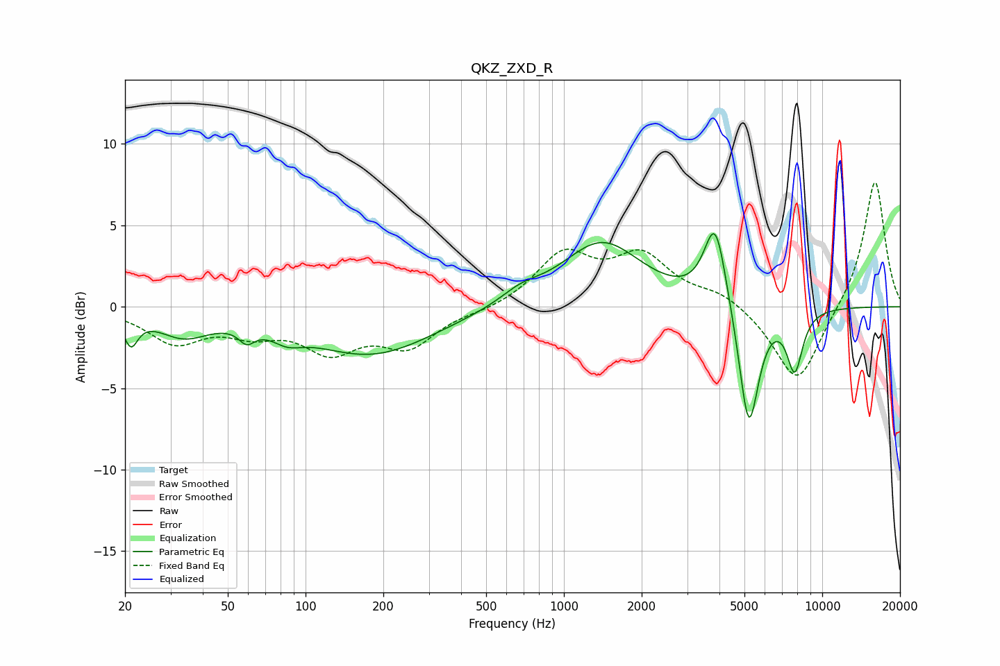

# QKZ_ZXD_R
See [usage instructions](https://github.com/jaakkopasanen/AutoEq#usage) for more options and info.

### Parametric EQs
Apply preamp of -4.6 dB when using parametric equalizer.

|   # | Type    |   Fc (Hz) |    Q |   Gain (dB) |
|-----|---------|-----------|------|-------------|
|   1 | Peaking |        21 | 5.3  |        -1.8 |
|   2 | Peaking |        34 | 1.38 |        -1.6 |
|   3 | Peaking |        59 | 4.71 |        -0.9 |
|   4 | Peaking |        85 | 2.38 |        -0.7 |
|   5 | Peaking |       179 | 0.58 |        -2.9 |
|   6 | Peaking |       680 | 1.81 |         0.7 |
|   7 | Peaking |      1401 | 0.92 |         4   |
|   8 | Peaking |      3854 | 3.25 |         5.2 |
|   9 | Peaking |      5197 | 3.55 |        -7.9 |
|  10 | Peaking |      7826 | 4.33 |        -3.7 |

### Fixed Band EQs
When using fixed band (also called graphic) equalizer, apply preamp of **-7.7 dB** (if available) and set gains manually with these parameters.

|   # | Type    |   Fc (Hz) |    Q |   Gain (dB) |
|-----|---------|-----------|------|-------------|
|   1 | Peaking |        31 | 1.41 |        -2.1 |
|   2 | Peaking |        62 | 1.41 |        -1.3 |
|   3 | Peaking |       125 | 1.41 |        -2.4 |
|   4 | Peaking |       250 | 1.41 |        -2.3 |
|   5 | Peaking |       500 | 1.41 |        -0.2 |
|   6 | Peaking |      1000 | 1.41 |         3.1 |
|   7 | Peaking |      2000 | 1.41 |         2.9 |
|   8 | Peaking |      4000 | 1.41 |         0.8 |
|   9 | Peaking |      8000 | 1.41 |        -4.9 |
|  10 | Peaking |     16000 | 1.41 |         7.9 |

### Graphs

