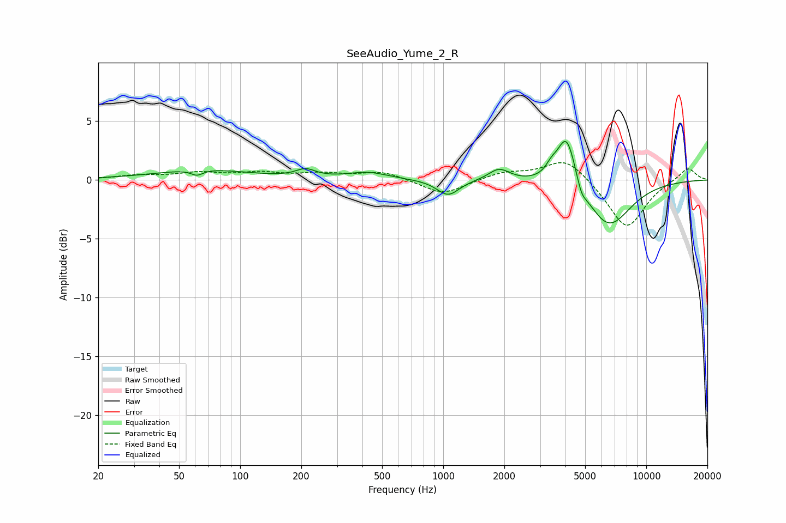

# SeeAudio_Yume_2_R
See [usage instructions](https://github.com/jaakkopasanen/AutoEq#usage) for more options and info.

### Parametric EQs
Apply preamp of -3.4 dB when using parametric equalizer.

|   # | Type    |   Fc (Hz) |    Q |   Gain (dB) |
|-----|---------|-----------|------|-------------|
|   1 | Peaking |        61 | 4.95 |        -0.5 |
|   2 | Peaking |        66 | 0.62 |         0.9 |
|   3 | Peaking |       210 | 2.97 |         0.7 |
|   4 | Peaking |       424 | 1.46 |         0.6 |
|   5 | Peaking |      1056 | 2.6  |        -1.3 |
|   6 | Peaking |      1884 | 2.74 |         1   |
|   7 | Peaking |      3404 | 4.88 |         0.7 |
|   8 | Peaking |      4052 | 3.01 |         4.6 |
|   9 | Peaking |      4793 | 6    |        -0.9 |
|  10 | Peaking |      6510 | 1.24 |        -4   |

### Fixed Band EQs
When using fixed band (also called graphic) equalizer, apply preamp of **-1.6 dB** (if available) and set gains manually with these parameters.

|   # | Type    |   Fc (Hz) |    Q |   Gain (dB) |
|-----|---------|-----------|------|-------------|
|   1 | Peaking |        31 | 1.41 |         0.3 |
|   2 | Peaking |        62 | 1.41 |         0.5 |
|   3 | Peaking |       125 | 1.41 |         0.5 |
|   4 | Peaking |       250 | 1.41 |         0.5 |
|   5 | Peaking |       500 | 1.41 |         0.7 |
|   6 | Peaking |      1000 | 1.41 |        -1.3 |
|   7 | Peaking |      2000 | 1.41 |         0.6 |
|   8 | Peaking |      4000 | 1.41 |         1.9 |
|   9 | Peaking |      8000 | 1.41 |        -4.2 |
|  10 | Peaking |     16000 | 1.41 |         1.1 |

### Graphs

