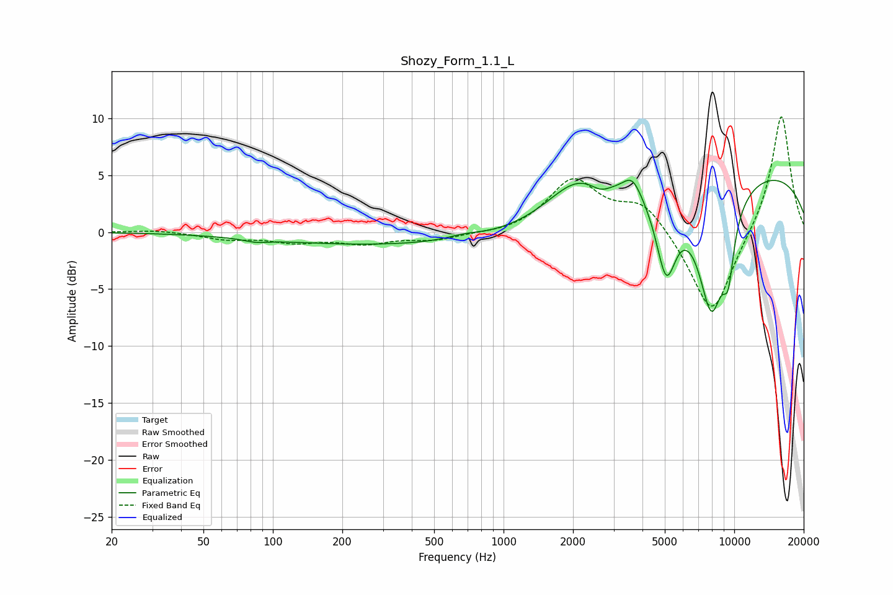

# Shozy_Form_1.1_L
See [usage instructions](https://github.com/jaakkopasanen/AutoEq#usage) for more options and info.

### Parametric EQs
Apply preamp of -4.7 dB when using parametric equalizer.

|   # | Type    |   Fc (Hz) |    Q |   Gain (dB) |
|-----|---------|-----------|------|-------------|
|   1 | Peaking |        85 | 2.8  |        -0.3 |
|   2 | Peaking |       427 | 0.2  |        -1.2 |
|   3 | Peaking |       675 | 1.87 |         0.4 |
|   4 | Peaking |      2060 | 1.1  |         2.9 |
|   5 | Peaking |      2633 | 3.39 |        -0.7 |
|   6 | Peaking |      3616 | 3.49 |         1.7 |
|   7 | Peaking |      5069 | 3.09 |        -7   |
|   8 | Peaking |      7970 | 2.03 |       -11.4 |
|   9 | Peaking |      9417 | 5.14 |        -4.3 |
|  10 | Peaking |     10000 | 0.2  |         5.8 |

### Fixed Band EQs
When using fixed band (also called graphic) equalizer, apply preamp of **-10.2 dB** (if available) and set gains manually with these parameters.

|   # | Type    |   Fc (Hz) |    Q |   Gain (dB) |
|-----|---------|-----------|------|-------------|
|   1 | Peaking |        31 | 1.41 |         0.2 |
|   2 | Peaking |        62 | 1.41 |        -0.6 |
|   3 | Peaking |       125 | 1.41 |        -0.8 |
|   4 | Peaking |       250 | 1.41 |        -0.9 |
|   5 | Peaking |       500 | 1.41 |        -0.6 |
|   6 | Peaking |      1000 | 1.41 |        -0.2 |
|   7 | Peaking |      2000 | 1.41 |         4.5 |
|   8 | Peaking |      4000 | 1.41 |         2.6 |
|   9 | Peaking |      8000 | 1.41 |        -7.6 |
|  10 | Peaking |     16000 | 1.41 |        10.6 |

### Graphs

