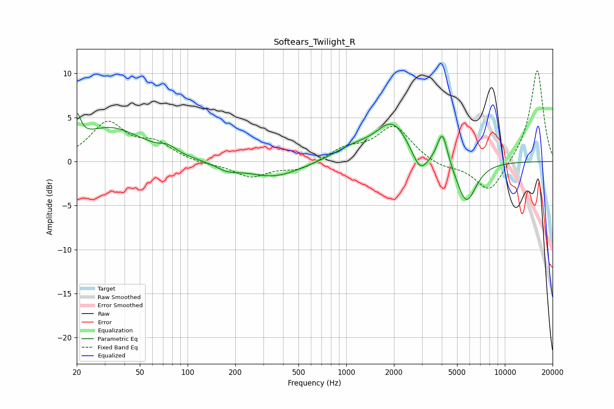

# Softears_Twilight_R
See [usage instructions](https://github.com/jaakkopasanen/AutoEq#usage) for more options and info.

### Parametric EQs
Apply preamp of -5.6 dB when using parametric equalizer.

|   # | Type    |   Fc (Hz) |    Q |   Gain (dB) |
|-----|---------|-----------|------|-------------|
|   1 | Peaking |        20 | 5.85 |         3   |
|   2 | Peaking |        32 | 0.7  |         3.8 |
|   3 | Peaking |        76 | 2.81 |         0.7 |
|   4 | Peaking |       179 | 1.86 |        -0.8 |
|   5 | Peaking |       350 | 0.83 |        -1.8 |
|   6 | Peaking |      1089 | 1.13 |         1.2 |
|   7 | Peaking |      1958 | 1.34 |         4.3 |
|   8 | Peaking |      2917 | 2.85 |        -2.5 |
|   9 | Peaking |      4037 | 4.31 |         3.8 |
|  10 | Peaking |      5720 | 2.24 |        -4.8 |

### Fixed Band EQs
When using fixed band (also called graphic) equalizer, apply preamp of **-10.4 dB** (if available) and set gains manually with these parameters.

|   # | Type    |   Fc (Hz) |    Q |   Gain (dB) |
|-----|---------|-----------|------|-------------|
|   1 | Peaking |        31 | 1.41 |         4.3 |
|   2 | Peaking |        62 | 1.41 |         1.8 |
|   3 | Peaking |       125 | 1.41 |        -0.3 |
|   4 | Peaking |       250 | 1.41 |        -1.7 |
|   5 | Peaking |       500 | 1.41 |        -0.9 |
|   6 | Peaking |      1000 | 1.41 |         1.4 |
|   7 | Peaking |      2000 | 1.41 |         4   |
|   8 | Peaking |      4000 | 1.41 |        -0.7 |
|   9 | Peaking |      8000 | 1.41 |        -3.7 |
|  10 | Peaking |     16000 | 1.41 |        10.5 |

### Graphs

