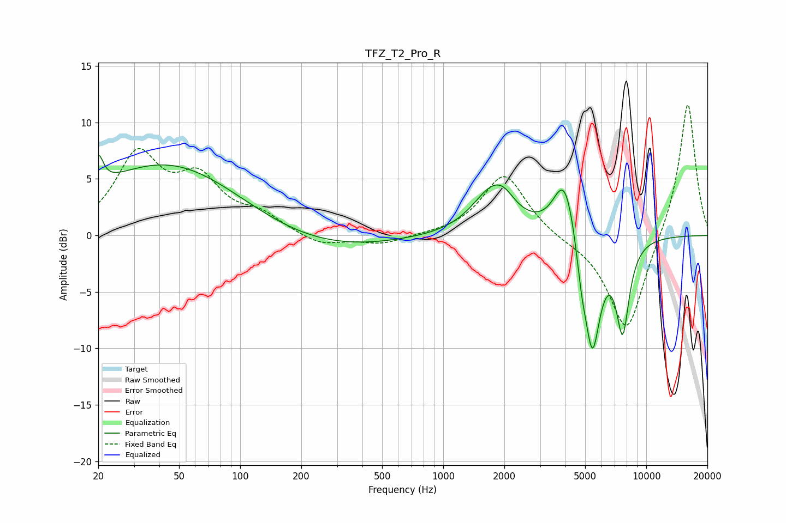

# TFZ_T2_Pro_R
See [usage instructions](https://github.com/jaakkopasanen/AutoEq#usage) for more options and info.

### Parametric EQs
Apply preamp of -7.2 dB when using parametric equalizer.

|   # | Type    |   Fc (Hz) |    Q |   Gain (dB) |
|-----|---------|-----------|------|-------------|
|   1 | Peaking |        20 | 5.99 |         2.7 |
|   2 | Peaking |        46 | 0.36 |         6.8 |
|   3 | Peaking |       194 | 0.36 |        -1.8 |
|   4 | Peaking |      1747 | 1.43 |         3.9 |
|   5 | Peaking |      1990 | 2.81 |         0.8 |
|   6 | Peaking |      3710 | 1.68 |        -1.4 |
|   7 | Peaking |      3956 | 2.22 |         7.1 |
|   8 | Peaking |      4799 | 5.45 |        -2.5 |
|   9 | Peaking |      5424 | 3.33 |       -10.4 |
|  10 | Peaking |      7653 | 4.03 |        -7.8 |

### Fixed Band EQs
When using fixed band (also called graphic) equalizer, apply preamp of **-11.7 dB** (if available) and set gains manually with these parameters.

|   # | Type    |   Fc (Hz) |    Q |   Gain (dB) |
|-----|---------|-----------|------|-------------|
|   1 | Peaking |        31 | 1.41 |         6.8 |
|   2 | Peaking |        62 | 1.41 |         4.4 |
|   3 | Peaking |       125 | 1.41 |         1.5 |
|   4 | Peaking |       250 | 1.41 |        -1   |
|   5 | Peaking |       500 | 1.41 |        -0.8 |
|   6 | Peaking |      1000 | 1.41 |         0   |
|   7 | Peaking |      2000 | 1.41 |         5.5 |
|   8 | Peaking |      4000 | 1.41 |        -0.3 |
|   9 | Peaking |      8000 | 1.41 |        -8.8 |
|  10 | Peaking |     16000 | 1.41 |        12.1 |

### Graphs

