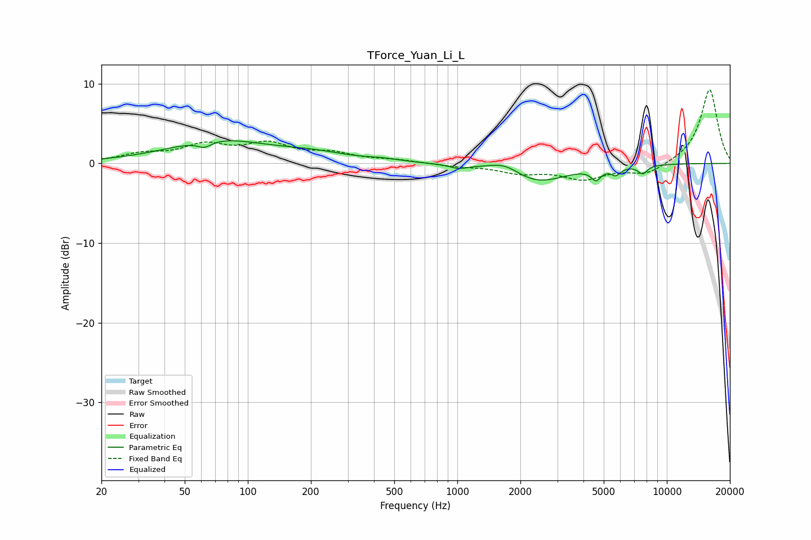

# TForce_Yuan_Li_L
See [usage instructions](https://github.com/jaakkopasanen/AutoEq#usage) for more options and info.

### Parametric EQs
Apply preamp of -2.9 dB when using parametric equalizer.

|   # | Type    |   Fc (Hz) |    Q |   Gain (dB) |
|-----|---------|-----------|------|-------------|
|   1 | Peaking |        62 | 4.33 |        -0.8 |
|   2 | Peaking |        72 | 0.6  |         2.8 |
|   3 | Peaking |       204 | 0.83 |         0.9 |
|   4 | Peaking |       443 | 1.83 |         0.3 |
|   5 | Peaking |      1013 | 3.37 |        -0.5 |
|   6 | Peaking |      1687 | 1.95 |         1.2 |
|   7 | Peaking |      2397 | 1.03 |        -2.4 |
|   8 | Peaking |      4598 | 6    |        -1.4 |
|   9 | Peaking |      5708 | 6    |        -1   |
|  10 | Peaking |      7672 | 5.84 |        -1   |

### Fixed Band EQs
When using fixed band (also called graphic) equalizer, apply preamp of **-9.3 dB** (if available) and set gains manually with these parameters.

|   # | Type    |   Fc (Hz) |    Q |   Gain (dB) |
|-----|---------|-----------|------|-------------|
|   1 | Peaking |        31 | 1.41 |         1   |
|   2 | Peaking |        62 | 1.41 |         2.1 |
|   3 | Peaking |       125 | 1.41 |         2.2 |
|   4 | Peaking |       250 | 1.41 |         1.1 |
|   5 | Peaking |       500 | 1.41 |         0.4 |
|   6 | Peaking |      1000 | 1.41 |        -0.3 |
|   7 | Peaking |      2000 | 1.41 |        -1.1 |
|   8 | Peaking |      4000 | 1.41 |        -1.8 |
|   9 | Peaking |      8000 | 1.41 |        -1.4 |
|  10 | Peaking |     16000 | 1.41 |         9.4 |

### Graphs

