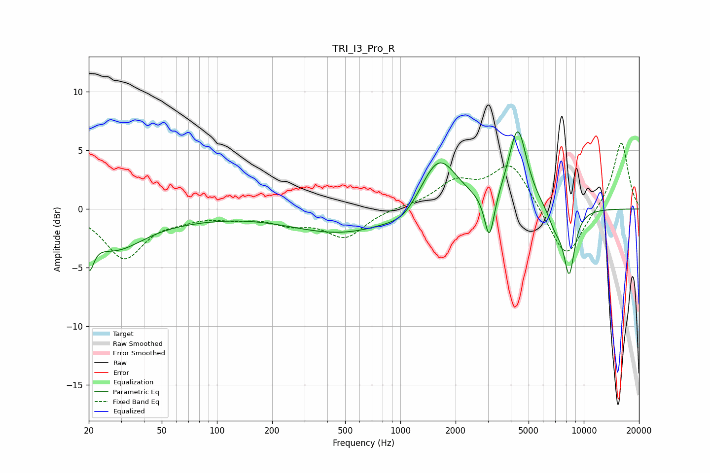

# TRI_I3_Pro_R
See [usage instructions](https://github.com/jaakkopasanen/AutoEq#usage) for more options and info.

### Parametric EQs
Apply preamp of -6.7 dB when using parametric equalizer.

|   # | Type    |   Fc (Hz) |    Q |   Gain (dB) |
|-----|---------|-----------|------|-------------|
|   1 | Peaking |        20 | 5.82 |        -2.7 |
|   2 | Peaking |        27 | 0.88 |        -3.1 |
|   3 | Peaking |        66 | 0.56 |        -0.5 |
|   4 | Peaking |       494 | 0.48 |        -2.1 |
|   5 | Peaking |      1048 | 1.65 |        -1   |
|   6 | Peaking |      1615 | 1.39 |         4.8 |
|   7 | Peaking |      3056 | 5.32 |        -4   |
|   8 | Peaking |      4365 | 2.81 |         6.8 |
|   9 | Peaking |      6996 | 3.37 |        -1.5 |
|  10 | Peaking |      8325 | 4.22 |        -5.4 |

### Fixed Band EQs
When using fixed band (also called graphic) equalizer, apply preamp of **-5.7 dB** (if available) and set gains manually with these parameters.

|   # | Type    |   Fc (Hz) |    Q |   Gain (dB) |
|-----|---------|-----------|------|-------------|
|   1 | Peaking |        31 | 1.41 |        -4.1 |
|   2 | Peaking |        62 | 1.41 |        -0.6 |
|   3 | Peaking |       125 | 1.41 |        -0.6 |
|   4 | Peaking |       250 | 1.41 |        -1   |
|   5 | Peaking |       500 | 1.41 |        -2.3 |
|   6 | Peaking |      1000 | 1.41 |         0.2 |
|   7 | Peaking |      2000 | 1.41 |         2.1 |
|   8 | Peaking |      4000 | 1.41 |         3.9 |
|   9 | Peaking |      8000 | 1.41 |        -4.5 |
|  10 | Peaking |     16000 | 1.41 |         5.8 |

### Graphs

