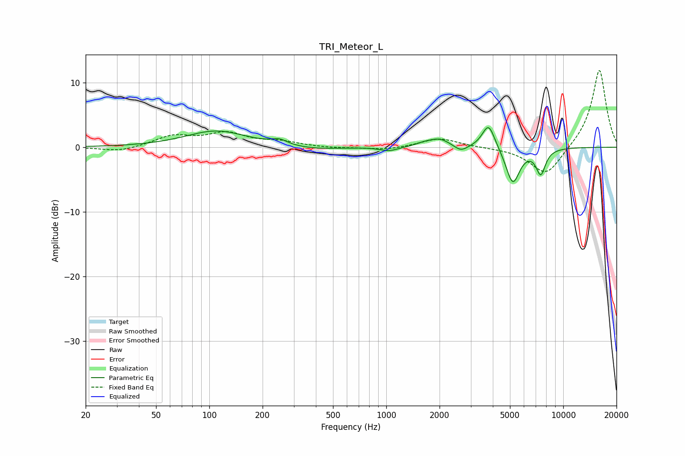

# TRI_Meteor_L
See [usage instructions](https://github.com/jaakkopasanen/AutoEq#usage) for more options and info.

### Parametric EQs
Apply preamp of -3.1 dB when using parametric equalizer.

|   # | Type    |   Fc (Hz) |    Q |   Gain (dB) |
|-----|---------|-----------|------|-------------|
|   1 | Peaking |       110 | 0.82 |         2.5 |
|   2 | Peaking |       249 | 3.32 |         0.8 |
|   3 | Peaking |       393 | 1.03 |        -0.5 |
|   4 | Peaking |      1035 | 2.85 |        -0.6 |
|   5 | Peaking |      1634 | 3.1  |         0.4 |
|   6 | Peaking |      2003 | 2.35 |         1.3 |
|   7 | Peaking |      2638 | 3.65 |        -1   |
|   8 | Peaking |      3786 | 3.9  |         3.9 |
|   9 | Peaking |      5189 | 3.58 |        -5.6 |
|  10 | Peaking |      7466 | 5    |        -3.8 |

### Fixed Band EQs
When using fixed band (also called graphic) equalizer, apply preamp of **-12.0 dB** (if available) and set gains manually with these parameters.

|   # | Type    |   Fc (Hz) |    Q |   Gain (dB) |
|-----|---------|-----------|------|-------------|
|   1 | Peaking |        31 | 1.41 |        -0.7 |
|   2 | Peaking |        62 | 1.41 |         1.6 |
|   3 | Peaking |       125 | 1.41 |         2   |
|   4 | Peaking |       250 | 1.41 |         0.7 |
|   5 | Peaking |       500 | 1.41 |        -0.2 |
|   6 | Peaking |      1000 | 1.41 |        -0.5 |
|   7 | Peaking |      2000 | 1.41 |         1.4 |
|   8 | Peaking |      4000 | 1.41 |        -0   |
|   9 | Peaking |      8000 | 1.41 |        -4.5 |
|  10 | Peaking |     16000 | 1.41 |        12.2 |

### Graphs

