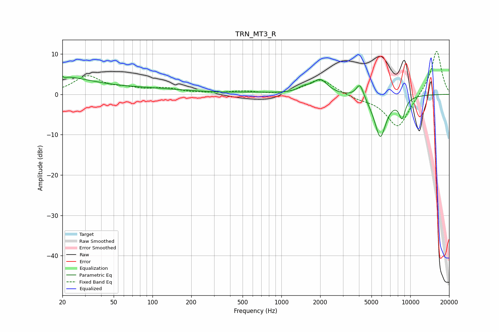

# TRN_MT3_R
See [usage instructions](https://github.com/jaakkopasanen/AutoEq#usage) for more options and info.

### Parametric EQs
Apply preamp of -4.6 dB when using parametric equalizer.

|   # | Type    |   Fc (Hz) |    Q |   Gain (dB) |
|-----|---------|-----------|------|-------------|
|   1 | Peaking |        20 | 4.94 |         3.4 |
|   2 | Peaking |        20 | 5.88 |        -3.1 |
|   3 | Peaking |        21 | 0.61 |         3.8 |
|   4 | Peaking |        92 | 0.42 |         1.2 |
|   5 | Peaking |       630 | 0.89 |         0.3 |
|   6 | Peaking |      1493 | 3.06 |         1.2 |
|   7 | Peaking |      2000 | 2.53 |         3.5 |
|   8 | Peaking |      4069 | 4.63 |         3.8 |
|   9 | Peaking |      5849 | 2.86 |       -10.6 |
|  10 | Peaking |      8641 | 5.12 |        -4.8 |

### Fixed Band EQs
When using fixed band (also called graphic) equalizer, apply preamp of **-10.7 dB** (if available) and set gains manually with these parameters.

|   # | Type    |   Fc (Hz) |    Q |   Gain (dB) |
|-----|---------|-----------|------|-------------|
|   1 | Peaking |        31 | 1.41 |         4.4 |
|   2 | Peaking |        62 | 1.41 |         1   |
|   3 | Peaking |       125 | 1.41 |         1.3 |
|   4 | Peaking |       250 | 1.41 |         0.1 |
|   5 | Peaking |       500 | 1.41 |         0.7 |
|   6 | Peaking |      1000 | 1.41 |        -0.2 |
|   7 | Peaking |      2000 | 1.41 |         3.9 |
|   8 | Peaking |      4000 | 1.41 |        -0.9 |
|   9 | Peaking |      8000 | 1.41 |        -8.5 |
|  10 | Peaking |     16000 | 1.41 |        11.2 |

### Graphs

