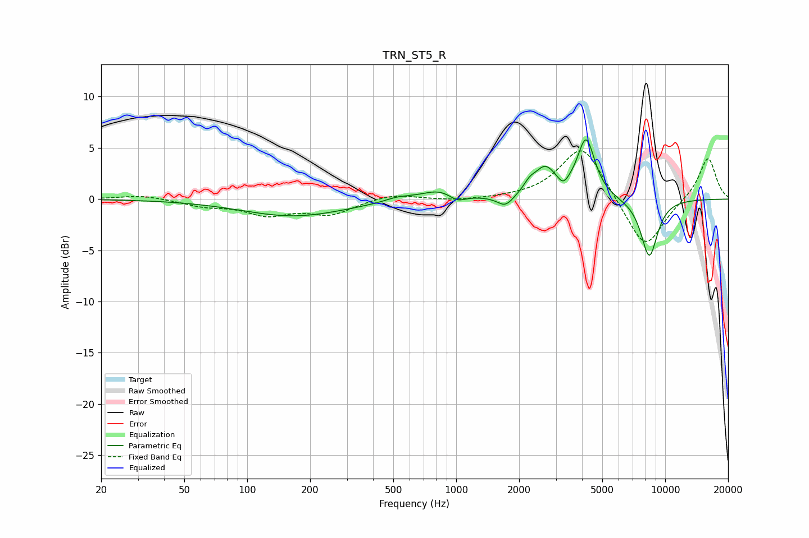

# TRN_ST5_R
See [usage instructions](https://github.com/jaakkopasanen/AutoEq#usage) for more options and info.

### Parametric EQs
Apply preamp of -5.9 dB when using parametric equalizer.

|   # | Type    |   Fc (Hz) |    Q |   Gain (dB) |
|-----|---------|-----------|------|-------------|
|   1 | Peaking |       167 | 0.57 |        -1.7 |
|   2 | Peaking |       527 | 2.19 |         0.4 |
|   3 | Peaking |       829 | 1.63 |         1   |
|   4 | Peaking |      1011 | 3.65 |        -0.7 |
|   5 | Peaking |      1720 | 3.68 |        -1.1 |
|   6 | Peaking |      2242 | 5.2  |         0.7 |
|   7 | Peaking |      2661 | 2.69 |         2.8 |
|   8 | Peaking |      3249 | 5.99 |        -0.8 |
|   9 | Peaking |      4184 | 3.36 |         5.7 |
|  10 | Peaking |      8391 | 3.18 |        -5.7 |

### Fixed Band EQs
When using fixed band (also called graphic) equalizer, apply preamp of **-4.8 dB** (if available) and set gains manually with these parameters.

|   # | Type    |   Fc (Hz) |    Q |   Gain (dB) |
|-----|---------|-----------|------|-------------|
|   1 | Peaking |        31 | 1.41 |         0.4 |
|   2 | Peaking |        62 | 1.41 |        -0.6 |
|   3 | Peaking |       125 | 1.41 |        -1.4 |
|   4 | Peaking |       250 | 1.41 |        -1.4 |
|   5 | Peaking |       500 | 1.41 |         0.6 |
|   6 | Peaking |      1000 | 1.41 |        -0.2 |
|   7 | Peaking |      2000 | 1.41 |         0.1 |
|   8 | Peaking |      4000 | 1.41 |         5.4 |
|   9 | Peaking |      8000 | 1.41 |        -5.1 |
|  10 | Peaking |     16000 | 1.41 |         4.2 |

### Graphs

