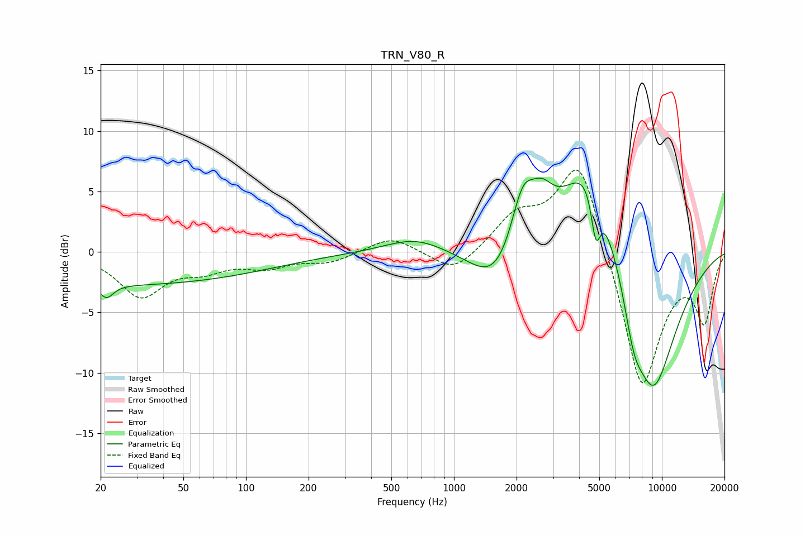

# TRN_V80_R
See [usage instructions](https://github.com/jaakkopasanen/AutoEq#usage) for more options and info.

### Parametric EQs
Apply preamp of -6.2 dB when using parametric equalizer.

|   # | Type    |   Fc (Hz) |    Q |   Gain (dB) |
|-----|---------|-----------|------|-------------|
|   1 | Peaking |        21 | 4.56 |        -1.1 |
|   2 | Peaking |        24 | 0.18 |        -2.7 |
|   3 | Peaking |       650 | 0.98 |         1.2 |
|   4 | Peaking |      1611 | 1.17 |        -3.7 |
|   5 | Peaking |      2137 | 2.4  |         5   |
|   6 | Peaking |      2654 | 2.47 |         2.4 |
|   7 | Peaking |      4498 | 1.02 |         9.2 |
|   8 | Peaking |      4810 | 5.96 |        -4.1 |
|   9 | Peaking |      7312 | 2.95 |        -3   |
|  10 | Peaking |      9033 | 1.02 |       -12.4 |

### Fixed Band EQs
When using fixed band (also called graphic) equalizer, apply preamp of **-6.9 dB** (if available) and set gains manually with these parameters.

|   # | Type    |   Fc (Hz) |    Q |   Gain (dB) |
|-----|---------|-----------|------|-------------|
|   1 | Peaking |        31 | 1.41 |        -3.6 |
|   2 | Peaking |        62 | 1.41 |        -1.2 |
|   3 | Peaking |       125 | 1.41 |        -1.1 |
|   4 | Peaking |       250 | 1.41 |        -0.8 |
|   5 | Peaking |       500 | 1.41 |         1.3 |
|   6 | Peaking |      1000 | 1.41 |        -1.9 |
|   7 | Peaking |      2000 | 1.41 |         2.7 |
|   8 | Peaking |      4000 | 1.41 |         8.3 |
|   9 | Peaking |      8000 | 1.41 |       -11.9 |
|  10 | Peaking |     16000 | 1.41 |        -5.4 |

### Graphs

