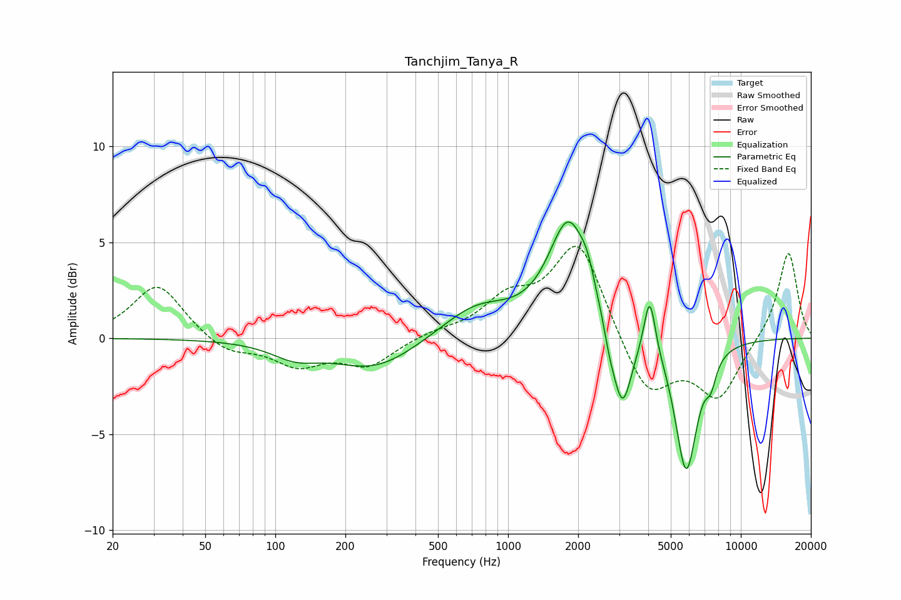

# Tanchjim_Tanya_R
See [usage instructions](https://github.com/jaakkopasanen/AutoEq#usage) for more options and info.

### Parametric EQs
Apply preamp of -6.2 dB when using parametric equalizer.

|   # | Type    |   Fc (Hz) |    Q |   Gain (dB) |
|-----|---------|-----------|------|-------------|
|   1 | Peaking |       122 | 1.39 |        -0.8 |
|   2 | Peaking |       269 | 0.79 |        -1.6 |
|   3 | Peaking |       731 | 0.93 |         1.6 |
|   4 | Peaking |      1822 | 1.65 |         5.9 |
|   5 | Peaking |      2194 | 4.78 |         0.9 |
|   6 | Peaking |      2725 | 6    |        -0.8 |
|   7 | Peaking |      3092 | 3.44 |        -4.3 |
|   8 | Peaking |      4060 | 5.82 |         3.1 |
|   9 | Peaking |      5822 | 2.91 |        -6.9 |
|  10 | Peaking |      7432 | 5.9  |        -1.1 |

### Fixed Band EQs
When using fixed band (also called graphic) equalizer, apply preamp of **-4.9 dB** (if available) and set gains manually with these parameters.

|   # | Type    |   Fc (Hz) |    Q |   Gain (dB) |
|-----|---------|-----------|------|-------------|
|   1 | Peaking |        31 | 1.41 |         2.9 |
|   2 | Peaking |        62 | 1.41 |        -0.8 |
|   3 | Peaking |       125 | 1.41 |        -1.3 |
|   4 | Peaking |       250 | 1.41 |        -1.4 |
|   5 | Peaking |       500 | 1.41 |         0.3 |
|   6 | Peaking |      1000 | 1.41 |         1.8 |
|   7 | Peaking |      2000 | 1.41 |         5.1 |
|   8 | Peaking |      4000 | 1.41 |        -3.1 |
|   9 | Peaking |      8000 | 1.41 |        -3   |
|  10 | Peaking |     16000 | 1.41 |         4.6 |

### Graphs

