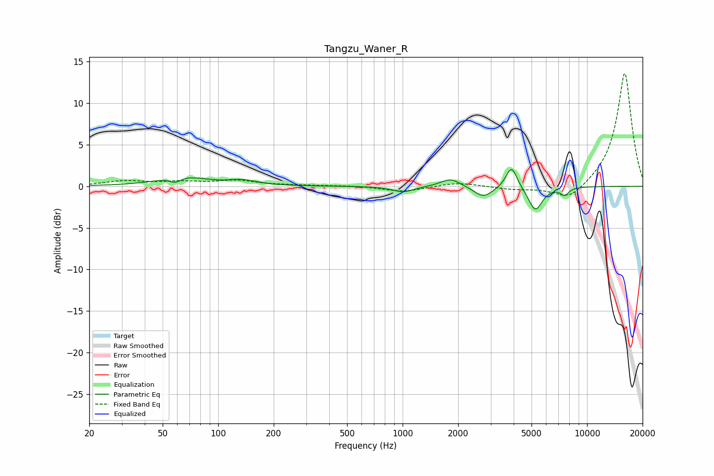

# Tangzu_Waner_R
See [usage instructions](https://github.com/jaakkopasanen/AutoEq#usage) for more options and info.

### Parametric EQs
Apply preamp of -2.1 dB when using parametric equalizer.

|   # | Type    |   Fc (Hz) |    Q |   Gain (dB) |
|-----|---------|-----------|------|-------------|
|   1 | Peaking |        59 | 4.58 |        -0.7 |
|   2 | Peaking |        64 | 1.12 |         1.2 |
|   3 | Peaking |       136 | 1.85 |         0.6 |
|   4 | Peaking |      1007 | 2.37 |        -0.7 |
|   5 | Peaking |      1821 | 2.59 |         1   |
|   6 | Peaking |      2740 | 2.83 |        -1.2 |
|   7 | Peaking |      2740 | 2.3  |        -0.1 |
|   8 | Peaking |      3894 | 4.73 |         2.7 |
|   9 | Peaking |      5243 | 3.77 |        -2.9 |
|  10 | Peaking |      7551 | 6    |        -0.9 |

### Fixed Band EQs
When using fixed band (also called graphic) equalizer, apply preamp of **-13.7 dB** (if available) and set gains manually with these parameters.

|   # | Type    |   Fc (Hz) |    Q |   Gain (dB) |
|-----|---------|-----------|------|-------------|
|   1 | Peaking |        31 | 1.41 |         0.6 |
|   2 | Peaking |        62 | 1.41 |         0.4 |
|   3 | Peaking |       125 | 1.41 |         0.6 |
|   4 | Peaking |       250 | 1.41 |         0.1 |
|   5 | Peaking |       500 | 1.41 |         0.1 |
|   6 | Peaking |      1000 | 1.41 |        -0.7 |
|   7 | Peaking |      2000 | 1.41 |         0.5 |
|   8 | Peaking |      4000 | 1.41 |        -0.4 |
|   9 | Peaking |      8000 | 1.41 |        -1.9 |
|  10 | Peaking |     16000 | 1.41 |        13.8 |

### Graphs

