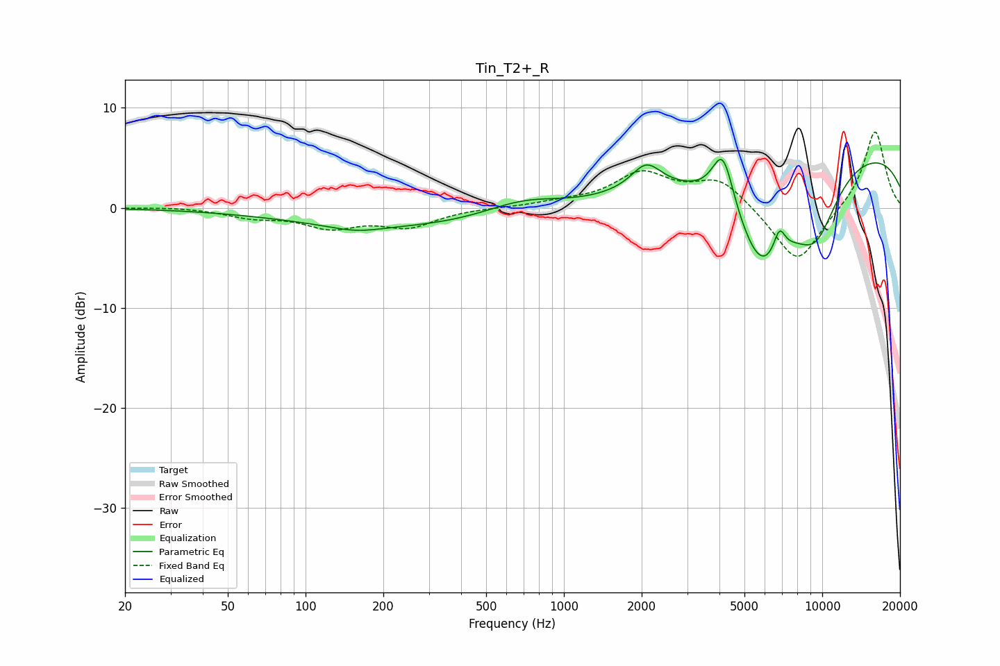

# Tin_T2+_R
See [usage instructions](https://github.com/jaakkopasanen/AutoEq#usage) for more options and info.

### Parametric EQs
Apply preamp of -4.9 dB when using parametric equalizer.

|   # | Type    |   Fc (Hz) |    Q |   Gain (dB) |
|-----|---------|-----------|------|-------------|
|   1 | Peaking |       156 | 1.38 |        -0.6 |
|   2 | Peaking |       309 | 0.25 |        -2   |
|   3 | Peaking |       635 | 0.92 |         0.5 |
|   4 | Peaking |       717 | 0.91 |         1.3 |
|   5 | Peaking |      2083 | 2.48 |         2.6 |
|   6 | Peaking |      4128 | 3.28 |         5.8 |
|   7 | Peaking |      5829 | 1.15 |       -10.3 |
|   8 | Peaking |      6826 | 6    |         2.5 |
|   9 | Peaking |      9418 | 1.39 |        -6.4 |
|  10 | Peaking |     10000 | 0.18 |         6.3 |

### Fixed Band EQs
When using fixed band (also called graphic) equalizer, apply preamp of **-7.7 dB** (if available) and set gains manually with these parameters.

|   # | Type    |   Fc (Hz) |    Q |   Gain (dB) |
|-----|---------|-----------|------|-------------|
|   1 | Peaking |        31 | 1.41 |         0.1 |
|   2 | Peaking |        62 | 1.41 |        -0.8 |
|   3 | Peaking |       125 | 1.41 |        -1.8 |
|   4 | Peaking |       250 | 1.41 |        -1.8 |
|   5 | Peaking |       500 | 1.41 |         0   |
|   6 | Peaking |      1000 | 1.41 |         0.4 |
|   7 | Peaking |      2000 | 1.41 |         3.3 |
|   8 | Peaking |      4000 | 1.41 |         2.8 |
|   9 | Peaking |      8000 | 1.41 |        -5.8 |
|  10 | Peaking |     16000 | 1.41 |         7.9 |

### Graphs

