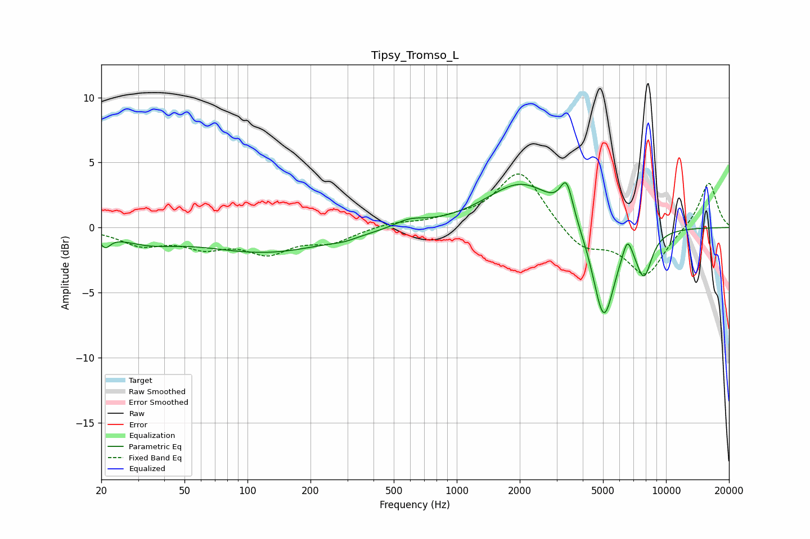

# Tipsy_Tromso_L
See [usage instructions](https://github.com/jaakkopasanen/AutoEq#usage) for more options and info.

### Parametric EQs
Apply preamp of -3.5 dB when using parametric equalizer.

|   # | Type    |   Fc (Hz) |    Q |   Gain (dB) |
|-----|---------|-----------|------|-------------|
|   1 | Peaking |        21 | 5.75 |        -0.9 |
|   2 | Peaking |        33 | 1.03 |        -0.9 |
|   3 | Peaking |       123 | 0.48 |        -1.9 |
|   4 | Peaking |       289 | 2.25 |        -0.2 |
|   5 | Peaking |       593 | 1.96 |         0.6 |
|   6 | Peaking |      2045 | 0.84 |         3.5 |
|   7 | Peaking |      3349 | 4.65 |         2.7 |
|   8 | Peaking |      5039 | 2.61 |        -7.4 |
|   9 | Peaking |      6540 | 5.99 |         1.5 |
|  10 | Peaking |      7839 | 3.45 |        -3.3 |

### Fixed Band EQs
When using fixed band (also called graphic) equalizer, apply preamp of **-4.2 dB** (if available) and set gains manually with these parameters.

|   # | Type    |   Fc (Hz) |    Q |   Gain (dB) |
|-----|---------|-----------|------|-------------|
|   1 | Peaking |        31 | 1.41 |        -1.2 |
|   2 | Peaking |        62 | 1.41 |        -1.3 |
|   3 | Peaking |       125 | 1.41 |        -1.8 |
|   4 | Peaking |       250 | 1.41 |        -1   |
|   5 | Peaking |       500 | 1.41 |         0.4 |
|   6 | Peaking |      1000 | 1.41 |         0.5 |
|   7 | Peaking |      2000 | 1.41 |         4.4 |
|   8 | Peaking |      4000 | 1.41 |        -1.7 |
|   9 | Peaking |      8000 | 1.41 |        -3.6 |
|  10 | Peaking |     16000 | 1.41 |         3.6 |

### Graphs

