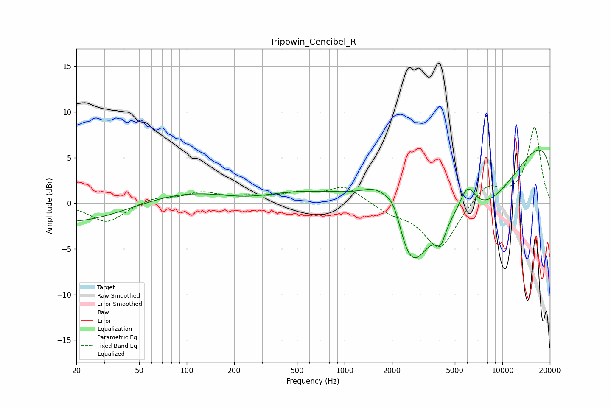

# Tripowin_Cencibel_R
See [usage instructions](https://github.com/jaakkopasanen/AutoEq#usage) for more options and info.

### Parametric EQs
Apply preamp of -5.9 dB when using parametric equalizer.

|   # | Type    |   Fc (Hz) |    Q |   Gain (dB) |
|-----|---------|-----------|------|-------------|
|   1 | Peaking |        20 | 0.37 |        -2.4 |
|   2 | Peaking |       183 | 0.22 |         2.2 |
|   3 | Peaking |       237 | 0.66 |        -1.3 |
|   4 | Peaking |      1658 | 1.42 |         2.6 |
|   5 | Peaking |      2068 | 2.74 |         2.7 |
|   6 | Peaking |      2614 | 1.18 |        -8.8 |
|   7 | Peaking |      4059 | 4.5  |        -2   |
|   8 | Peaking |      6010 | 2.62 |         3.2 |
|   9 | Peaking |      7174 | 0.36 |       -12   |
|  10 | Peaking |     10000 | 0.18 |        12.3 |

### Fixed Band EQs
When using fixed band (also called graphic) equalizer, apply preamp of **-8.4 dB** (if available) and set gains manually with these parameters.

|   # | Type    |   Fc (Hz) |    Q |   Gain (dB) |
|-----|---------|-----------|------|-------------|
|   1 | Peaking |        31 | 1.41 |        -2.1 |
|   2 | Peaking |        62 | 1.41 |         0.6 |
|   3 | Peaking |       125 | 1.41 |         1.1 |
|   4 | Peaking |       250 | 1.41 |         0.5 |
|   5 | Peaking |       500 | 1.41 |         0.9 |
|   6 | Peaking |      1000 | 1.41 |         1.8 |
|   7 | Peaking |      2000 | 1.41 |        -0.9 |
|   8 | Peaking |      4000 | 1.41 |        -5.1 |
|   9 | Peaking |      8000 | 1.41 |         2.1 |
|  10 | Peaking |     16000 | 1.41 |         8.3 |

### Graphs

