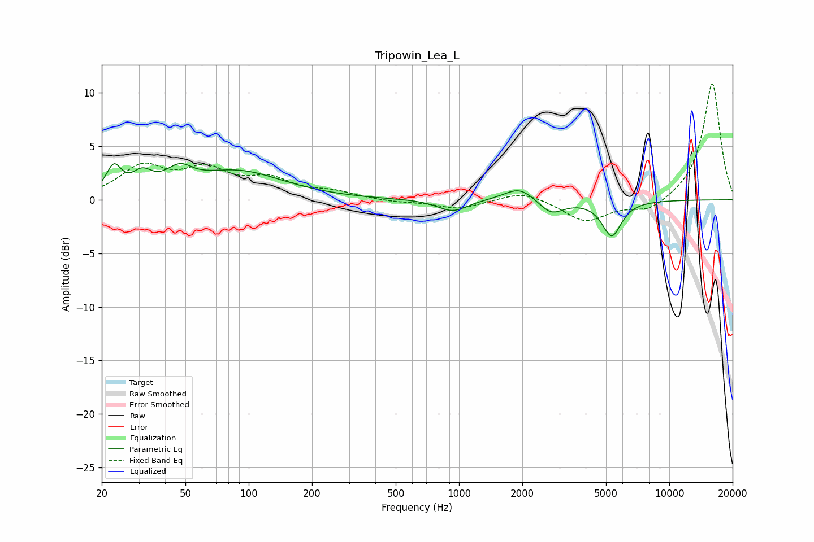

# Tripowin_Lea_L
See [usage instructions](https://github.com/jaakkopasanen/AutoEq#usage) for more options and info.

### Parametric EQs
Apply preamp of -3.5 dB when using parametric equalizer.

|   # | Type    |   Fc (Hz) |    Q |   Gain (dB) |
|-----|---------|-----------|------|-------------|
|   1 | Peaking |        23 | 4.03 |         2.5 |
|   2 | Peaking |        31 | 3.02 |         1.6 |
|   3 | Peaking |        46 | 3.26 |        -1.6 |
|   4 | Peaking |        46 | 2.74 |         3.3 |
|   5 | Peaking |        89 | 0.66 |         2.6 |
|   6 | Peaking |       932 | 1.99 |        -1.1 |
|   7 | Peaking |      1940 | 2.04 |         1   |
|   8 | Peaking |      1950 | 1.61 |         0.3 |
|   9 | Peaking |      2739 | 2.39 |        -1.4 |
|  10 | Peaking |      5322 | 3.04 |        -3.3 |

### Fixed Band EQs
When using fixed band (also called graphic) equalizer, apply preamp of **-10.9 dB** (if available) and set gains manually with these parameters.

|   # | Type    |   Fc (Hz) |    Q |   Gain (dB) |
|-----|---------|-----------|------|-------------|
|   1 | Peaking |        31 | 1.41 |         2.9 |
|   2 | Peaking |        62 | 1.41 |         2.5 |
|   3 | Peaking |       125 | 1.41 |         1.7 |
|   4 | Peaking |       250 | 1.41 |         0.6 |
|   5 | Peaking |       500 | 1.41 |        -0.2 |
|   6 | Peaking |      1000 | 1.41 |        -0.8 |
|   7 | Peaking |      2000 | 1.41 |         0.9 |
|   8 | Peaking |      4000 | 1.41 |        -2   |
|   9 | Peaking |      8000 | 1.41 |        -1.1 |
|  10 | Peaking |     16000 | 1.41 |        11   |

### Graphs

