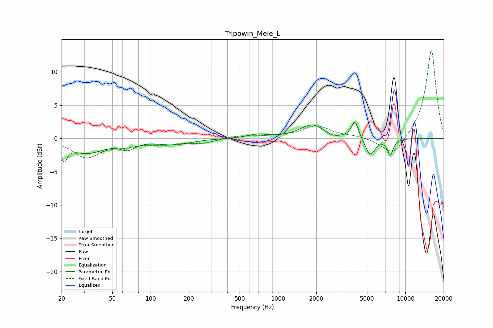

# Tripowin_Mele_L
See [usage instructions](https://github.com/jaakkopasanen/AutoEq#usage) for more options and info.

### Parametric EQs
Apply preamp of -2.5 dB when using parametric equalizer.

|   # | Type    |   Fc (Hz) |    Q |   Gain (dB) |
|-----|---------|-----------|------|-------------|
|   1 | Peaking |        21 | 5.98 |        -2.4 |
|   2 | Peaking |        32 | 1.03 |        -2.1 |
|   3 | Peaking |        66 | 2.6  |        -1.1 |
|   4 | Peaking |       152 | 1.1  |        -0.9 |
|   5 | Peaking |       688 | 1.9  |         0.5 |
|   6 | Peaking |      1878 | 1.42 |         2.1 |
|   7 | Peaking |      2636 | 2.51 |        -0.5 |
|   8 | Peaking |      4021 | 5.03 |         2.7 |
|   9 | Peaking |      5294 | 3.61 |        -2.6 |
|  10 | Peaking |      7616 | 5.73 |        -2.3 |

### Fixed Band EQs
When using fixed band (also called graphic) equalizer, apply preamp of **-13.3 dB** (if available) and set gains manually with these parameters.

|   # | Type    |   Fc (Hz) |    Q |   Gain (dB) |
|-----|---------|-----------|------|-------------|
|   1 | Peaking |        31 | 1.41 |        -2.8 |
|   2 | Peaking |        62 | 1.41 |        -0.8 |
|   3 | Peaking |       125 | 1.41 |        -0.7 |
|   4 | Peaking |       250 | 1.41 |        -0.7 |
|   5 | Peaking |       500 | 1.41 |         0.4 |
|   6 | Peaking |      1000 | 1.41 |         0.3 |
|   7 | Peaking |      2000 | 1.41 |         1.8 |
|   8 | Peaking |      4000 | 1.41 |         0.3 |
|   9 | Peaking |      8000 | 1.41 |        -2.9 |
|  10 | Peaking |     16000 | 1.41 |        13.4 |

### Graphs

