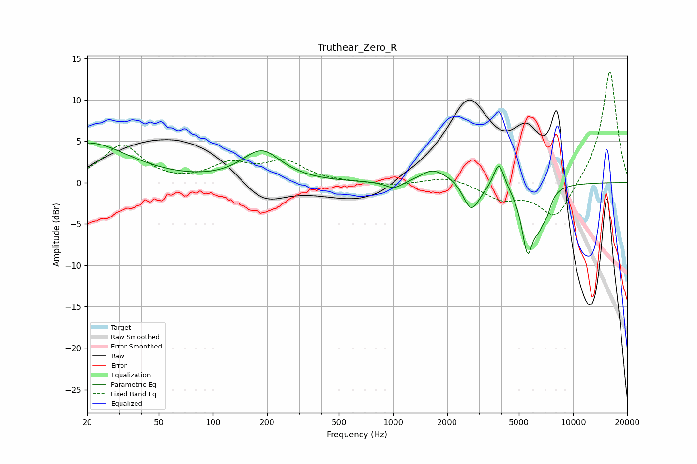

# Truthear_Zero_R
See [usage instructions](https://github.com/jaakkopasanen/AutoEq#usage) for more options and info.

### Parametric EQs
Apply preamp of -4.9 dB when using parametric equalizer.

|   # | Type    |   Fc (Hz) |    Q |   Gain (dB) |
|-----|---------|-----------|------|-------------|
|   1 | Peaking |        20 | 0.62 |         4.8 |
|   2 | Peaking |       186 | 1.31 |         3.7 |
|   3 | Peaking |      1011 | 3.03 |        -0.9 |
|   4 | Peaking |      1664 | 2.1  |         1.6 |
|   5 | Peaking |      2277 | 2.1  |         0.8 |
|   6 | Peaking |      2707 | 2.87 |        -3.8 |
|   7 | Peaking |      3871 | 4.78 |         3.3 |
|   8 | Peaking |      5583 | 4.1  |        -7.7 |
|   9 | Peaking |      6457 | 4.68 |        -2.6 |
|  10 | Peaking |      7138 | 5.38 |        -1.8 |

### Fixed Band EQs
When using fixed band (also called graphic) equalizer, apply preamp of **-13.5 dB** (if available) and set gains manually with these parameters.

|   # | Type    |   Fc (Hz) |    Q |   Gain (dB) |
|-----|---------|-----------|------|-------------|
|   1 | Peaking |        31 | 1.41 |         4.5 |
|   2 | Peaking |        62 | 1.41 |        -0.2 |
|   3 | Peaking |       125 | 1.41 |         2.1 |
|   4 | Peaking |       250 | 1.41 |         2.4 |
|   5 | Peaking |       500 | 1.41 |         0   |
|   6 | Peaking |      1000 | 1.41 |        -0.4 |
|   7 | Peaking |      2000 | 1.41 |         0.8 |
|   8 | Peaking |      4000 | 1.41 |        -1.9 |
|   9 | Peaking |      8000 | 1.41 |        -4.5 |
|  10 | Peaking |     16000 | 1.41 |        13.8 |

### Graphs

