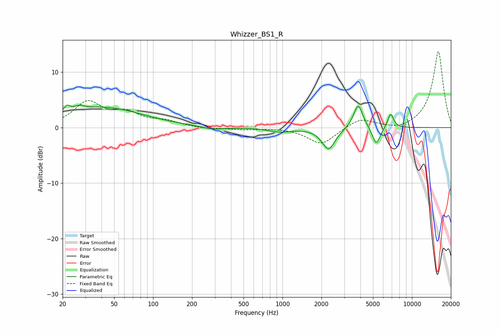

# Whizzer_BS1_R
See [usage instructions](https://github.com/jaakkopasanen/AutoEq#usage) for more options and info.

### Parametric EQs
Apply preamp of -4.1 dB when using parametric equalizer.

|   # | Type    |   Fc (Hz) |    Q |   Gain (dB) |
|-----|---------|-----------|------|-------------|
|   1 | Peaking |        21 | 6    |        -1.9 |
|   2 | Peaking |        21 | 5.95 |         3.1 |
|   3 | Peaking |        27 | 3.61 |         0.7 |
|   4 | Peaking |        40 | 0.45 |         3.6 |
|   5 | Peaking |       292 | 1.69 |        -0.5 |
|   6 | Peaking |       955 | 1.55 |        -0.7 |
|   7 | Peaking |      2269 | 2.79 |        -3.9 |
|   8 | Peaking |      3843 | 3.96 |         4.4 |
|   9 | Peaking |      5302 | 4.56 |        -3.2 |
|  10 | Peaking |      6845 | 5.94 |         2.7 |

### Fixed Band EQs
When using fixed band (also called graphic) equalizer, apply preamp of **-13.8 dB** (if available) and set gains manually with these parameters.

|   # | Type    |   Fc (Hz) |    Q |   Gain (dB) |
|-----|---------|-----------|------|-------------|
|   1 | Peaking |        31 | 1.41 |         4.4 |
|   2 | Peaking |        62 | 1.41 |         2.2 |
|   3 | Peaking |       125 | 1.41 |         1   |
|   4 | Peaking |       250 | 1.41 |        -0.3 |
|   5 | Peaking |       500 | 1.41 |        -0.3 |
|   6 | Peaking |      1000 | 1.41 |         0   |
|   7 | Peaking |      2000 | 1.41 |        -3.1 |
|   8 | Peaking |      4000 | 1.41 |         1.7 |
|   9 | Peaking |      8000 | 1.41 |        -0.6 |
|  10 | Peaking |     16000 | 1.41 |        13.8 |

### Graphs

