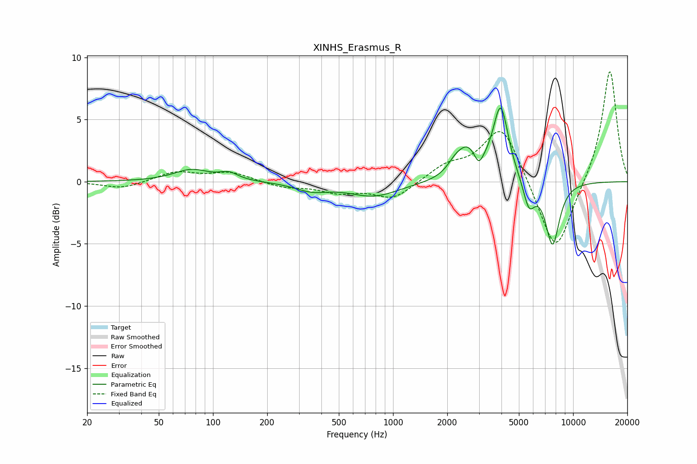

# XINHS_Erasmus_R
See [usage instructions](https://github.com/jaakkopasanen/AutoEq#usage) for more options and info.

### Parametric EQs
Apply preamp of -6.0 dB when using parametric equalizer.

|   # | Type    |   Fc (Hz) |    Q |   Gain (dB) |
|-----|---------|-----------|------|-------------|
|   1 | Peaking |        76 | 1.43 |         0.9 |
|   2 | Peaking |       122 | 2.85 |         0.6 |
|   3 | Peaking |       354 | 1.55 |        -0.6 |
|   4 | Peaking |       782 | 1.02 |        -1.2 |
|   5 | Peaking |      2199 | 3.38 |         0.7 |
|   6 | Peaking |      2581 | 2.38 |         2.3 |
|   7 | Peaking |      2992 | 5.96 |        -1   |
|   8 | Peaking |      3962 | 3.29 |         6   |
|   9 | Peaking |      5694 | 4.29 |        -2.2 |
|  10 | Peaking |      7688 | 3.42 |        -5.1 |

### Fixed Band EQs
When using fixed band (also called graphic) equalizer, apply preamp of **-9.0 dB** (if available) and set gains manually with these parameters.

|   # | Type    |   Fc (Hz) |    Q |   Gain (dB) |
|-----|---------|-----------|------|-------------|
|   1 | Peaking |        31 | 1.41 |        -0.6 |
|   2 | Peaking |        62 | 1.41 |         0.8 |
|   3 | Peaking |       125 | 1.41 |         0.7 |
|   4 | Peaking |       250 | 1.41 |        -0.4 |
|   5 | Peaking |       500 | 1.41 |        -0.8 |
|   6 | Peaking |      1000 | 1.41 |        -1.4 |
|   7 | Peaking |      2000 | 1.41 |         1.2 |
|   8 | Peaking |      4000 | 1.41 |         4.7 |
|   9 | Peaking |      8000 | 1.41 |        -6.1 |
|  10 | Peaking |     16000 | 1.41 |         9.2 |

### Graphs

