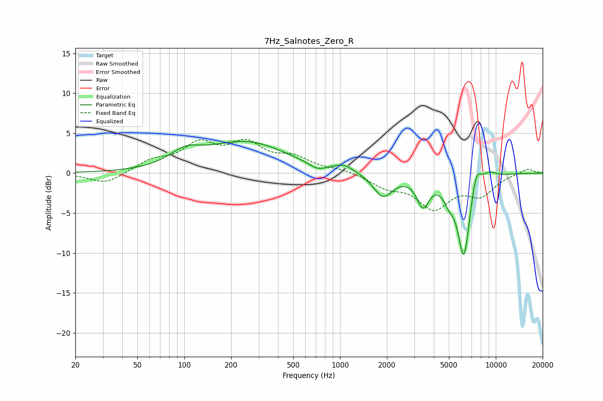

# 7Hz_Salnotes_Zero_R
See [usage instructions](https://github.com/jaakkopasanen/AutoEq#usage) for more options and info.

### Parametric EQs
Apply preamp of -4.1 dB when using parametric equalizer.

|   # | Type    |   Fc (Hz) |    Q |   Gain (dB) |
|-----|---------|-----------|------|-------------|
|   1 | Peaking |       101 | 1.43 |         1.7 |
|   2 | Peaking |       249 | 0.55 |         3.8 |
|   3 | Peaking |       713 | 2.67 |        -0.7 |
|   4 | Peaking |      1063 | 2.42 |         0.8 |
|   5 | Peaking |      1886 | 2.3  |        -2.9 |
|   6 | Peaking |      3413 | 3.55 |        -3.5 |
|   7 | Peaking |      4999 | 3.82 |        -1.7 |
|   8 | Peaking |      6237 | 3.44 |       -10.3 |
|   9 | Peaking |      7499 | 4.32 |         2.7 |
|  10 | Peaking |      9095 | 3.07 |         0.7 |

### Fixed Band EQs
When using fixed band (also called graphic) equalizer, apply preamp of **-4.3 dB** (if available) and set gains manually with these parameters.

|   # | Type    |   Fc (Hz) |    Q |   Gain (dB) |
|-----|---------|-----------|------|-------------|
|   1 | Peaking |        31 | 1.41 |        -1.4 |
|   2 | Peaking |        62 | 1.41 |         1.4 |
|   3 | Peaking |       125 | 1.41 |         3.3 |
|   4 | Peaking |       250 | 1.41 |         3.3 |
|   5 | Peaking |       500 | 1.41 |         1.7 |
|   6 | Peaking |      1000 | 1.41 |         0.4 |
|   7 | Peaking |      2000 | 1.41 |        -1.5 |
|   8 | Peaking |      4000 | 1.41 |        -4.1 |
|   9 | Peaking |      8000 | 1.41 |        -2.5 |
|  10 | Peaking |     16000 | 1.41 |         0.6 |

### Graphs

