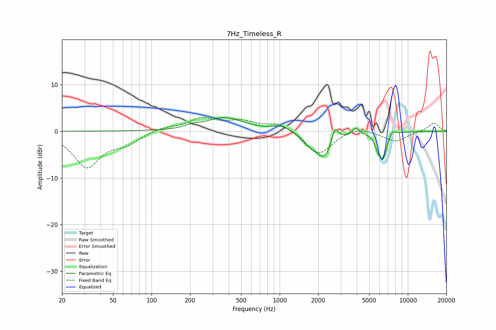

# 7Hz_Timeless_R
See [usage instructions](https://github.com/jaakkopasanen/AutoEq#usage) for more options and info.

### Parametric EQs
Apply preamp of -3.0 dB when using parametric equalizer.

|   # | Type    |   Fc (Hz) |    Q |   Gain (dB) |
|-----|---------|-----------|------|-------------|
|   1 | Peaking |       208 | 3.4  |         0.5 |
|   2 | Peaking |       369 | 0.96 |         2.9 |
|   3 | Peaking |      1030 | 2.04 |         1.1 |
|   4 | Peaking |      1711 | 2.98 |        -1.5 |
|   5 | Peaking |      2232 | 2.12 |        -5.7 |
|   6 | Peaking |      2691 | 5.3  |         3.6 |
|   7 | Peaking |      3911 | 5.39 |         1.4 |
|   8 | Peaking |      5816 | 6    |        -1.8 |
|   9 | Peaking |      6388 | 4.6  |        -5.5 |
|  10 | Peaking |      7585 | 5.76 |         1.2 |

### Fixed Band EQs
When using fixed band (also called graphic) equalizer, apply preamp of **-3.1 dB** (if available) and set gains manually with these parameters.

|   # | Type    |   Fc (Hz) |    Q |   Gain (dB) |
|-----|---------|-----------|------|-------------|
|   1 | Peaking |        31 | 1.41 |        -7.5 |
|   2 | Peaking |        62 | 1.41 |        -2.2 |
|   3 | Peaking |       125 | 1.41 |         0.8 |
|   4 | Peaking |       250 | 1.41 |         2.6 |
|   5 | Peaking |       500 | 1.41 |         1.9 |
|   6 | Peaking |      1000 | 1.41 |         1.8 |
|   7 | Peaking |      2000 | 1.41 |        -5.2 |
|   8 | Peaking |      4000 | 1.41 |         1.2 |
|   9 | Peaking |      8000 | 1.41 |        -2.2 |
|  10 | Peaking |     16000 | 1.41 |         1.8 |

### Graphs

