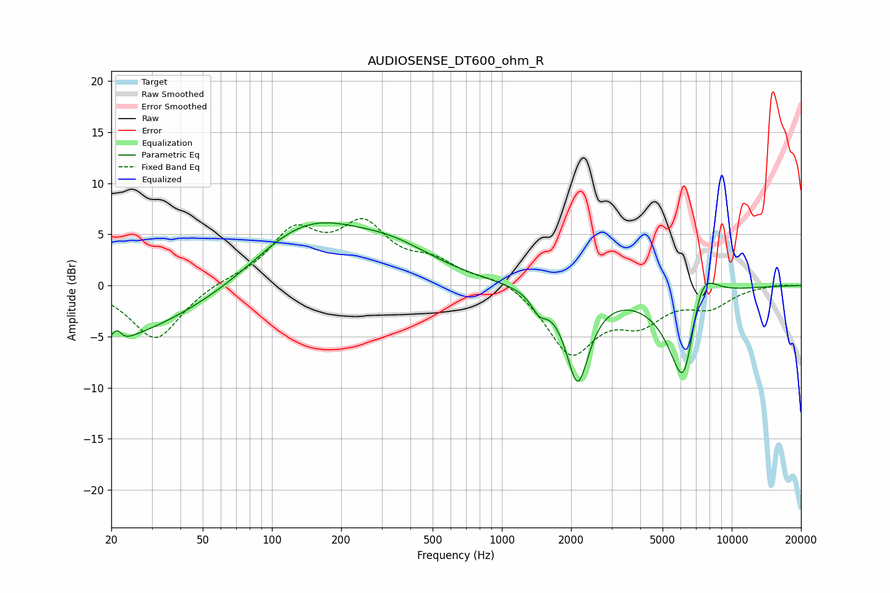

# AUDIOSENSE_DT600_ohm_R
See [usage instructions](https://github.com/jaakkopasanen/AutoEq#usage) for more options and info.

### Parametric EQs
Apply preamp of -6.2 dB when using parametric equalizer.

|   # | Type    |   Fc (Hz) |    Q |   Gain (dB) |
|-----|---------|-----------|------|-------------|
|   1 | Peaking |        20 | 0.45 |        -5   |
|   2 | Peaking |        21 | 4.01 |        -3.1 |
|   3 | Peaking |        21 | 5.38 |         3.5 |
|   4 | Peaking |        68 | 0.57 |        -1.3 |
|   5 | Peaking |       139 | 0.55 |         6.4 |
|   6 | Peaking |       342 | 0.76 |         2.2 |
|   7 | Peaking |      1453 | 4.24 |        -1.6 |
|   8 | Peaking |      2135 | 2.76 |        -9.1 |
|   9 | Peaking |      6211 | 1.98 |       -12.8 |
|  10 | Peaking |      7235 | 1.91 |         7   |

### Fixed Band EQs
When using fixed band (also called graphic) equalizer, apply preamp of **-6.6 dB** (if available) and set gains manually with these parameters.

|   # | Type    |   Fc (Hz) |    Q |   Gain (dB) |
|-----|---------|-----------|------|-------------|
|   1 | Peaking |        31 | 1.41 |        -5.4 |
|   2 | Peaking |        62 | 1.41 |         0.4 |
|   3 | Peaking |       125 | 1.41 |         4.9 |
|   4 | Peaking |       250 | 1.41 |         5.3 |
|   5 | Peaking |       500 | 1.41 |         1.9 |
|   6 | Peaking |      1000 | 1.41 |         0.9 |
|   7 | Peaking |      2000 | 1.41 |        -6.5 |
|   8 | Peaking |      4000 | 1.41 |        -3   |
|   9 | Peaking |      8000 | 1.41 |        -1.8 |
|  10 | Peaking |     16000 | 1.41 |         0.1 |

### Graphs

