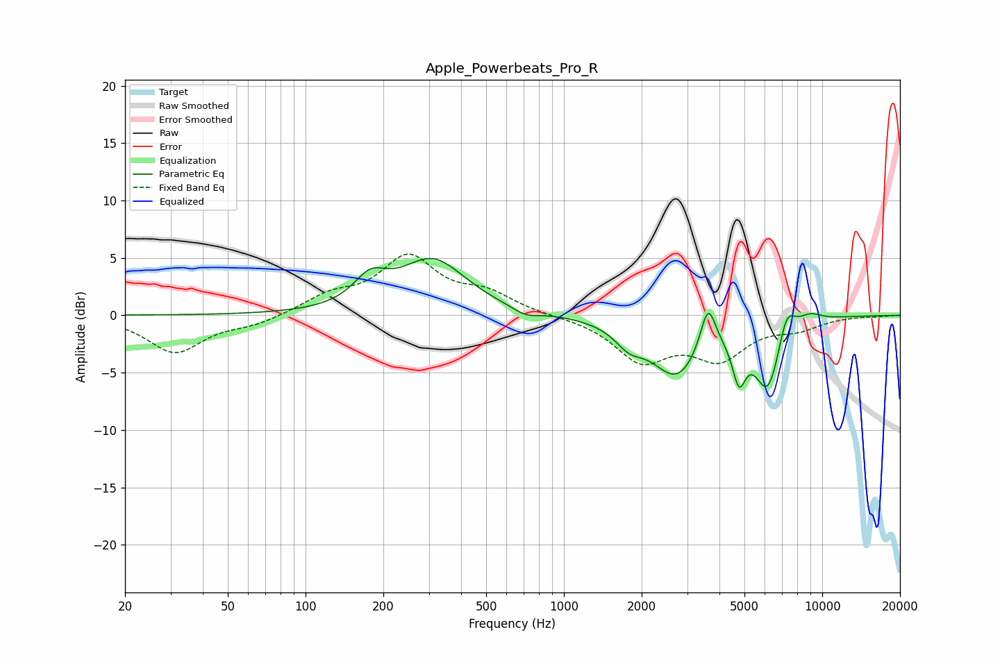

# Apple_Powerbeats_Pro_R
See [usage instructions](https://github.com/jaakkopasanen/AutoEq#usage) for more options and info.

### Parametric EQs
Apply preamp of -5.0 dB when using parametric equalizer.

|   # | Type    |   Fc (Hz) |    Q |   Gain (dB) |
|-----|---------|-----------|------|-------------|
|   1 | Peaking |       178 | 2.23 |         2.3 |
|   2 | Peaking |       311 | 1.1  |         4.7 |
|   3 | Peaking |       711 | 2.78 |        -0.7 |
|   4 | Peaking |      1789 | 2.59 |        -1.5 |
|   5 | Peaking |      2735 | 1.44 |        -5.1 |
|   6 | Peaking |      3614 | 4.68 |         4   |
|   7 | Peaking |      4764 | 5.46 |        -3.8 |
|   8 | Peaking |      6165 | 2.63 |        -6.1 |
|   9 | Peaking |      7276 | 4.11 |         2.7 |
|  10 | Peaking |      8946 | 2.79 |         0.8 |

### Fixed Band EQs
When using fixed band (also called graphic) equalizer, apply preamp of **-5.4 dB** (if available) and set gains manually with these parameters.

|   # | Type    |   Fc (Hz) |    Q |   Gain (dB) |
|-----|---------|-----------|------|-------------|
|   1 | Peaking |        31 | 1.41 |        -3.2 |
|   2 | Peaking |        62 | 1.41 |        -0.7 |
|   3 | Peaking |       125 | 1.41 |         1.5 |
|   4 | Peaking |       250 | 1.41 |         4.9 |
|   5 | Peaking |       500 | 1.41 |         1.7 |
|   6 | Peaking |      1000 | 1.41 |        -0   |
|   7 | Peaking |      2000 | 1.41 |        -3.7 |
|   8 | Peaking |      4000 | 1.41 |        -3.4 |
|   9 | Peaking |      8000 | 1.41 |        -0.9 |
|  10 | Peaking |     16000 | 1.41 |        -0.1 |

### Graphs

