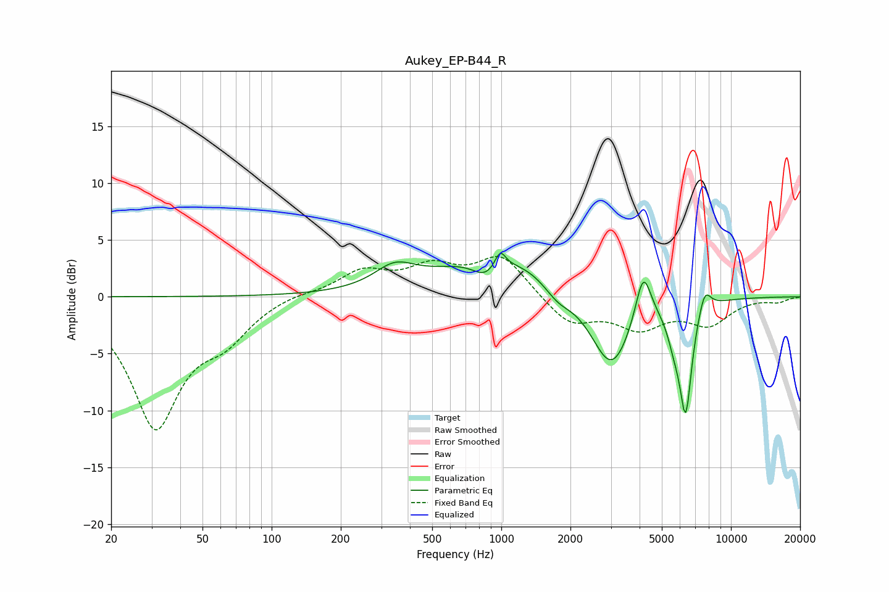

# Aukey_EP-B44_R
See [usage instructions](https://github.com/jaakkopasanen/AutoEq#usage) for more options and info.

### Parametric EQs
Apply preamp of -3.9 dB when using parametric equalizer.

|   # | Type    |   Fc (Hz) |    Q |   Gain (dB) |
|-----|---------|-----------|------|-------------|
|   1 | Peaking |       343 | 1.63 |         1.8 |
|   2 | Peaking |       857 | 2.41 |        -1.6 |
|   3 | Peaking |       988 | 6    |         1.5 |
|   4 | Peaking |      1052 | 0.51 |         3.9 |
|   5 | Peaking |      1760 | 2.12 |        -1.6 |
|   6 | Peaking |      3013 | 1.51 |        -7.1 |
|   7 | Peaking |      4150 | 4.02 |         4.6 |
|   8 | Peaking |      5668 | 4.5  |        -2   |
|   9 | Peaking |      6352 | 5.04 |        -9.4 |
|  10 | Peaking |      7683 | 5.01 |         2   |

### Fixed Band EQs
When using fixed band (also called graphic) equalizer, apply preamp of **-3.6 dB** (if available) and set gains manually with these parameters.

|   # | Type    |   Fc (Hz) |    Q |   Gain (dB) |
|-----|---------|-----------|------|-------------|
|   1 | Peaking |        31 | 1.41 |       -11.2 |
|   2 | Peaking |        62 | 1.41 |        -2.7 |
|   3 | Peaking |       125 | 1.41 |         0.4 |
|   4 | Peaking |       250 | 1.41 |         2.1 |
|   5 | Peaking |       500 | 1.41 |         2.3 |
|   6 | Peaking |      1000 | 1.41 |         3.5 |
|   7 | Peaking |      2000 | 1.41 |        -2.4 |
|   8 | Peaking |      4000 | 1.41 |        -2.5 |
|   9 | Peaking |      8000 | 1.41 |        -2.2 |
|  10 | Peaking |     16000 | 1.41 |        -0.4 |

### Graphs

